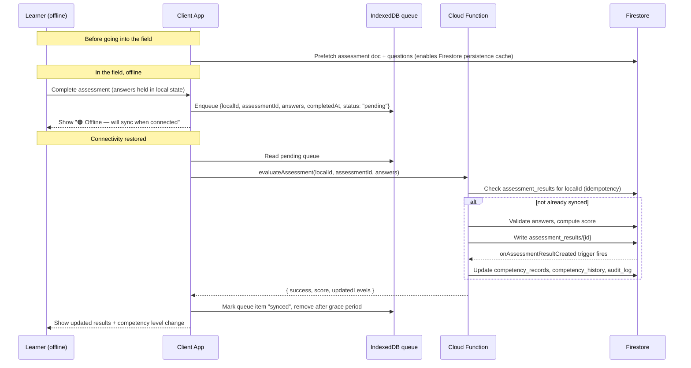
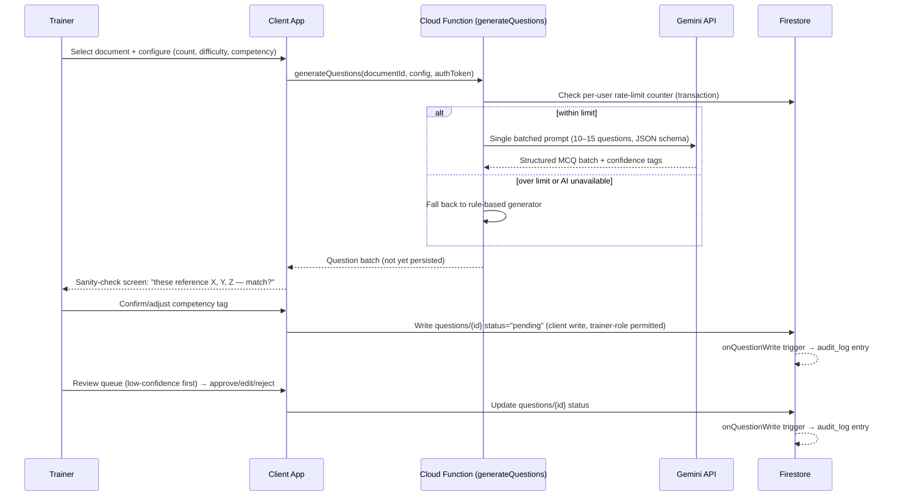
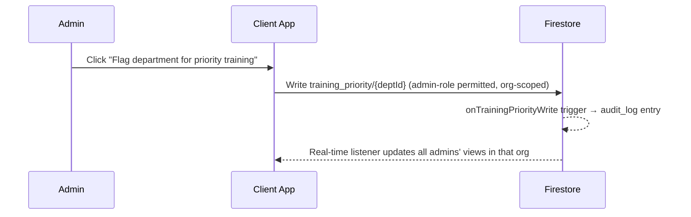

# Architecture.md

## StatVidya — System Architecture, App Flow & Tech Stack

| Field              | Value                                                                                                    |
| ------------------ | -------------------------------------------------------------------------------------------------------- |
| Companion document | PRD.md (defines _what_ and _why_; this defines _how_)                                                    |
| Status             | Draft  v1.0                                                                                               |
| Scope              | Frontend, backend/serverless, data layer, offline architecture, folder structure, tech stack, deployment |

> **How to read this document**: Section 1 explains a few decisions that deliberately diverge from the source implementation plan, and why. If you only read one section before building, read that one — it prevents you from re-introducing complexity the PRD already decided to defer.

---

## Table of Contents

1. [Architecture Principles & Deviations from the Source Plan](#1-architecture-principles--deviations-from-the-source-plan)
2. [Tech Stack](#2-tech-stack)
3. [High-Level Architecture](#3-high-level-architecture)
4. [App Flow](#4-app-flow)
5. [Service Layer Design](#5-service-layer-design)
6. [State & Data Flow (Frontend)](#6-state--data-flow-frontend)
7. [Backend: Cloud Functions Design](#7-backend-cloud-functions-design)
8. [Offline Architecture](#8-offline-architecture)
9. [Data Layer](#9-data-layer)
10. [Folder & File Structure](#10-folder--file-structure)
11. [Environments & Configuration](#11-environments--configuration)
12. [Build, CI & Deployment](#12-build-ci--deployment)
13. [Migration Paths to V2](#13-migration-paths-to-v2)
14. [Architecture Decision Log](#14-architecture-decision-log)

---

## 1. Architecture Principles & Deviations from the Source Plan

Carried over from PRD §3, made concrete here:

- **Server enforces, client suggests.** Nothing the client computes about a score or a competency level is trusted. The client may _display_ a locally computed preview (e.g., "this looks like it'll close a High gap"), but the value that actually gets written comes from a server-side recomputation.
- **Offline is a first-class client capability, not a network-outage edge case.** The Field Investigator persona is the primary persona (PRD §6.1); the architecture below is designed around their constraints first, then verified to also work fine for a desk officer on broadband.
- **Provenance is structural, not conventional.** Every domain-data record carries a `provenance` field enforced at the type level (TypeScript) and checked at build/seed time — not something a developer has to remember to set.
- **Audit logging happens where it can't be forgotten.** Where possible, audit entries are written by database triggers reacting to state changes, not by application code remembering to call a logging function at every call site.

### Deviations from the source implementation plan (and why)

| Source plan decision                                                                                                | This architecture                                                                                                                                                                                      | Reason                                                                                                                                                                                                                                                                                                                                                                                                                                                        |
| ------------------------------------------------------------------------------------------------------------------- | ------------------------------------------------------------------------------------------------------------------------------------------------------------------------------------------------------ | ------------------------------------------------------------------------------------------------------------------------------------------------------------------------------------------------------------------------------------------------------------------------------------------------------------------------------------------------------------------------------------------------------------------------------------------------------------- |
| Two cloud providers: Firebase (Auth/Firestore) + Cloudflare (Workers for AI proxy + presigned URLs, R2 for storage) | **Single provider for MVP/V1: Firebase/GCP** (Auth, Firestore, Storage, Cloud Functions, Hosting). Cloudflare (Workers + R2) reintroduced only in V2, if/when file-storage cost actually justifies it. | The PRD already demoted R2 to a stretch goal (PRD §11.7, out-of-scope table). If R2 isn't needed yet, there's no reason to stand up a second cloud platform just to host the AI proxy — Firebase Cloud Functions does that job natively, colocated with the Admin SDK. One platform is strictly less operational surface for a small team. The service-layer abstraction (§5) means swapping the proxy/storage backend later touches one module, not the app. |
| Plain JavaScript throughout                                                                                         | **TypeScript** for the frontend, Cloud Functions, and any shared package                                                                                                                               | The riskiest code in this product is the scoring/formula layer (gap severity, readiness index, level promotion) — the PRD itself flags a wrong silent result here as the most damaging class of bug (PRD §17/§24 equivalent). Static types on Firestore document shapes and formula inputs catch a large class of these before they ship.                                                                                                                     |
| Audit logging as a manual call embedded in each feature (`auditService.log(...)` sprinkled through code)            | **Audit logging via Firestore triggers** on the collections that must be audited                                                                                                                       | A manual call can be forgotten in exactly the one code path that matters later. A trigger reacting to `onCreate`/`onWrite` on `assessment_results`, `questions`, and `training_priority` cannot be skipped by a future feature branch.                                                                                                                                                                                                                        |
| Custom IndexedDB caching for "offline competency data" broadly                                                      | **Use Firestore's built-in offline persistence for reads**; hand-roll a queue only for the one write that must go through a server-validated Cloud Function while offline (assessment submission)      | Firestore already solves "let the user see cached data offline" for free. Reinventing that is wasted effort. The only genuinely hard problem is queuing a _write that needs server-side validation_ until connectivity returns — that's the one thing worth building custom.                                                                                                                                                                                  |
| Fully custom SVG for every chart                                                                                    | **Custom SVG for bespoke shapes (radar chart, progress ring); a lightweight charting library for data-plot charts (scatter + trend line for the outcome-correlation chart, PRD FR-ADMIN-5)**           | A scatter plot with a regression trend line is a solved problem; hand-rolling it isn't a good use of hackathon time. Reserve custom SVG for shapes no library does well.                                                                                                                                                                                                                                                                                      |

---

## 2. Tech Stack

| Layer                       | Choice                                                                                                                                                                                        | Notes                                                                                                                                   |
| --------------------------- | --------------------------------------------------------------------------------------------------------------------------------------------------------------------------------------------- | --------------------------------------------------------------------------------------------------------------------------------------- |
| Frontend framework          | React (latest 19.x) + Vite (latest stable)                                                                                                                                                    | Fast dev server, wide ecosystem familiarity                                                                                             |
| Language                    | TypeScript throughout (frontend + functions)                                                                                                                                                  | See §1 rationale                                                                                                                        |
| Routing                     | React Router (latest v7.x)                                                                                                                                                                    | Role-aware route guards (§4.2)                                                                                                          |
| Styling                     | Tailwind CSS (latest 4.x)                                                                                                                                                                     | Utility-first, fast to theme (see Design.md)                                                                                            |
| Animation                   | Framer Motion                                                                                                                                                                                 | Used sparingly — micro-interactions, page transitions, not core UX logic                                                                |
| Charts                      | Custom SVG (radar chart, progress ring, gap severity bars) + a lightweight charting library, e.g. Recharts (scatter + trend line for outcome correlation, line charts for competency history) | See §1 deviation table                                                                                                                  |
| State management            | React Context + hooks, backed by the service layer (§5)                                                                                                                                       | No Redux/Zustand needed at this scale; add only if cross-cutting state (e.g., offline status) becomes genuinely awkward through Context |
| i18n                        | `react-i18next` + `i18next-browser-languagedetector`                                                                                                                                          | Namespaced locale JSON files; see PRD FR-I18N-1                                                                                         |
| PWA                         | `vite-plugin-pwa` (Workbox under the hood)                                                                                                                                                    | App-shell precaching, manifest generation, runtime caching config                                                                       |
| Offline structured storage  | `idb` (thin IndexedDB wrapper) for the custom pending-results queue                                                                                                                           | Firestore's own persistence covers cached reads (§8)                                                                                    |
| PDF processing              | `pdf.js` for text extraction; `tesseract.js` for OCR fallback on scanned pages                                                                                                                | Client-side, runs during document ingestion                                                                                             |
| Auth                        | Firebase Authentication (Email/Password + Google OAuth)                                                                                                                                       | Simulated "Parichay SSO" is a thin UI wrapper around pre-seeded demo accounts, not a real SSO protocol integration                      |
| Primary database            | Firebase Firestore                                                                                                                                                                            | Document model, real-time listeners, native Auth integration, built-in offline persistence                                              |
| File storage                | Firebase Storage                                                                                                                                                                              | Default for all document sizes in MVP/V1; presigned-URL-equivalent pattern via Firebase Admin SDK signed URLs                           |
| Serverless functions        | Firebase Cloud Functions (2nd gen, Node.js 20+ runtime)                                                                                                                                       | Callable functions + Firestore triggers (§7)                                                                                            |
| AI provider                 | Gemini (Flash-class model, model name via environment variable — never hardcoded)                                                                                                             | Called only from Cloud Functions, never from the client                                                                                 |
| AI fallback                 | Rule-based question generator (in-repo, no external dependency)                                                                                                                               | Activates automatically if Gemini is unavailable or over quota (PRD FR-CONTENT-9)                                                       |
| Testing                     | Vitest (unit), Testing Library (component), Playwright (deferred to V1.1 for E2E)                                                                                                             | Unit coverage required for all formulas (PRD §11.3–11.4) from MVP                                                                       |
| Lint/format                 | ESLint + Prettier                                                                                                                                                                             | Enforced in CI                                                                                                                          |
| Hosting/CD                  | Firebase Hosting, connected to a git repo for preview + production deploys                                                                                                                    | Keeps deploy target on the same platform as everything else                                                                             |
| Monorepo tooling (optional) | npm/pnpm workspaces, only if the shared formula package (§13) is adopted                                                                                                                      | Skip if it adds more overhead than value for a solo build                                                                               |

---

## 3. High-Level Architecture

```
┌───────────────────────────────────────────────────────────┐
│ CLIENT (React + Vite, PWA)                                 │
│  Pages → Contexts → Services → Firebase SDK / Callable fns │
│  Local cache: Firestore persistence (reads) + IndexedDB     │
│  queue (offline assessment submission only)                 │
└───────────────────────────┬─────────────────────────────────┘
                            │ Firebase SDK (Auth, Firestore, Storage)
                            │ + HTTPS Callable functions
┌───────────────────────────┴─────────────────────────────────┐
│ FIREBASE / GCP                                              │
│                                                              │
│  Auth            Firestore              Storage             │
│  (Email/Google)  (rules-enforced)       (signed URLs)       │
│                                                              │
│  Cloud Functions (2nd gen)                                  │
│   ├─ callable: evaluateAssessment                            │
│   ├─ callable: generateQuestions (AI proxy)                  │
│   ├─ callable: getUploadUrl                                  │
│   └─ triggers: onAssessmentResultCreated,                    │
│               onQuestionWrite, onTrainingPriorityWrite        │
└───────────────────────────┬─────────────────────────────────┘
                            │ HTTPS (server-side only)
┌───────────────────────────┴─────────────────────────────────┐
│ EXTERNAL                                                     │
│  Gemini API (primary AI)                                     │
│  iGOT Karmayogi — mock adapter now; no live call in MVP/V1    │
└───────────────────────────────────────────────────────────┘
```

**Rule of thumb for "does this need a Cloud Function?"**: if the write affects a competency level, an assessment score, an audit log, or requires calling an external paid API, it goes through a function. If it's a same-organization, role-permitted write to a non-sensitive field (e.g., a trainer creating a `documents` record, an admin toggling `trainingPriority`), a direct client write governed by Firestore rules is simpler and sufficient — don't add a function for the sake of it.

---

## 4. App Flow

### 4.1 Route map

| Path                         | Page                         | Roles                             | Notes                                                    |
| ---------------------------- | ---------------------------- | --------------------------------- | -------------------------------------------------------- |
| `/`                          | Landing                      | Public                            | Marketing/positioning page                               |
| `/login`, `/signup`          | Auth pages                   | Public                            | Includes simulated Parichay SSO persona picker           |
| `/onboarding`                | Onboarding                   | Authenticated, profile incomplete | Multi-step; redirects to `/dashboard` once complete      |
| `/dashboard`                 | Dashboard                    | learner, trainer, admin           | Content varies by role                                   |
| `/profile`                   | Profile                      | learner, trainer, admin           | Own profile only, except admin drill-down (below)        |
| `/skill-gap`                 | Skill Gap Analysis           | learner                           |                                                          |
| `/pathways`                  | Learning Pathways            | learner                           |                                                          |
| `/assessment/:assessmentId`  | Assessment-taking            | learner                           | Must work fully offline once cached (§8)                 |
| `/documents`                 | Document Manager             | trainer, admin                    | Upload + status                                          |
| `/mcq-generator/:documentId` | MCQ Generator + review queue | trainer, admin                    |                                                          |
| `/question-bank`             | Question Bank                | trainer, admin                    |                                                          |
| `/admin/analytics`           | Workforce Intelligence       | admin                             | Org overview, narrative, outcome correlation, write-back |
| `/admin/users/:uid`          | Individual drill-down        | admin                             | Same-org only, enforced server-side                      |
| `/settings`                  | Settings                     | learner, trainer, admin           | Theme, language, notification prefs                      |

Route guarding is two-layered per PRD §15.2: a `RequireRole` wrapper component redirects/hides at the UI layer; Firestore rules and Cloud Function checks are the actual enforcement.

### 4.2 Sequence: Assessment taken offline, synced later



### 4.3 Sequence: Trainer AI content generation



### 4.4 Sequence: Admin write-back action



---

## 5. Service Layer Design

Services are framework-agnostic TypeScript modules. They do not import React. Contexts (§6) call services and expose reactive state to components. This is the seam that makes the V2 migrations in §13 possible without a rewrite.

| Service                 | Responsibility                                                                                                                                                         | Called from                                                                                                                          |
| ----------------------- | ---------------------------------------------------------------------------------------------------------------------------------------------------------------------- | ------------------------------------------------------------------------------------------------------------------------------------ |
| `competencyService`     | Gap severity formula, readiness index, level-promotion thresholds (read/display only — the authoritative write happens in the `onAssessmentResultCreated` trigger, §7) | Skill Gap page, Dashboard, Profile                                                                                                   |
| `assessmentService`     | Adaptive branching logic (client-side, for UX responsiveness), answer collection, submission orchestration (calls `evaluateAssessment` or enqueues offline)            | Assessment page                                                                                                                      |
| `recommendationService` | Course ranking formula, pathway construction, explainability strings                                                                                                   | Learning Pathways                                                                                                                    |
| `contentService`        | Orchestrates the document pipeline: extraction → chunking → generation request → review state                                                                          | Document Manager, MCQ Generator                                                                                                      |
| `aiService`             | Client-side formatter/caller for the `generateQuestions` callable and any assistant/explanation calls; never touches an API key directly                               | MCQ Generator, AI Assistant, Explain-the-gap                                                                                         |
| `storageService`        | Upload/download via Firebase Storage, wraps the signed-URL flow                                                                                                        | Document Manager                                                                                                                     |
| `integrationService`    | iGOT adapter (mock now; documented live contract for V2)                                                                                                               | Learning Pathways, Profile (Karma Points)                                                                                            |
| `offlineService`        | Manages the IndexedDB pending-results queue, connectivity detection, sync trigger, exposes `{ isOnline, pendingCount, lastSyncAt }`                                    | Assessment page, global offline indicator                                                                                            |
| `questionGenerator`     | Rule-based MCQ generation (no external dependency) — the AI fallback                                                                                                   | `contentService`, Cloud Function fallback (same logic, used both client- and server-side if feasible, or a Node-portable equivalent) |

---

## 6. State & Data Flow (Frontend)

- **Context providers** wrap the app in a fixed order at the root: `UserContext` → `OfflineContext` → feature contexts (`CompetencyContext`, `AssessmentContext`, `DocumentContext`, `NotificationContext`).
- Each feature context subscribes to the relevant Firestore collection(s) via `onSnapshot` where real-time reactivity matters (e.g., a trainer's review queue updating as AI generation completes), and calls the corresponding service for anything computational.
- **Firestore is the source of truth for reads**; components never hold a copy of server state they mutate directly and hope syncs later — the one exception, deliberately, is assessment answers while offline, which live in local component/context state until submission (§8).
- **Derived/computed values** (gap severity, readiness index) are computed in the service layer from raw Firestore data on every render/subscription update, not stored redundantly in component state, to avoid drift.

---

## 7. Backend: Cloud Functions Design

### 7.1 Callable functions

| Function             | Purpose                                         | Key behavior                                                                                                                                                                                                                             |
| -------------------- | ----------------------------------------------- | ---------------------------------------------------------------------------------------------------------------------------------------------------------------------------------------------------------------------------------------- |
| `evaluateAssessment` | Score a submitted assessment server-side        | Validates Firebase Auth token; checks idempotency via client-generated `localId`; recomputes score from stored correct answers (never trusts a client-submitted score); writes `assessment_results`                                      |
| `generateQuestions`  | AI-proxy for MCQ generation                     | Validates token; atomically checks/increments a per-user rate-limit counter (Firestore transaction); calls Gemini with a versioned prompt; falls back to rule-based generation on failure/quota; returns the batch without persisting it |
| `getUploadUrl`       | Issue a signed URL for direct-to-Storage upload | Validates token + role (trainer/admin); checks file size/type before signing; short TTL                                                                                                                                                  |

### 7.2 Firestore triggers

| Trigger                     | Fires on                                      | Effect                                                                                                                     |
| --------------------------- | --------------------------------------------- | -------------------------------------------------------------------------------------------------------------------------- |
| `onAssessmentResultCreated` | Create on `assessment_results/{id}`           | Computes level-promotion, updates `competency_records/{uid}`, appends `competency_history`, appends `audit_log`            |
| `onQuestionWrite`           | Create/update on `questions/{id}`             | Appends `audit_log` entry capturing the AI-generation event or trainer review action, with prompt version where applicable |
| `onTrainingPriorityWrite`   | Create/update on `training_priority/{deptId}` | Appends `audit_log` entry for the admin write-back action                                                                  |

### 7.3 Rate limiting (no external cache needed)

A `rate_limits/{uid}_{yyyyMMdd}` document holds a request counter. `generateQuestions` runs a Firestore transaction: read the counter, reject if at daily limit, otherwise increment and proceed. This avoids introducing Redis/KV for a limit that resets daily and only needs to be roughly accurate, not sub-millisecond.

### 7.4 Idempotency for offline sync

The client generates a UUID (`localId`) when an assessment is completed offline, before any network call is attempted. `evaluateAssessment` treats `localId` as the intended document ID (or a unique field checked in a transaction) so that a retried sync call — due to a flaky reconnect — never double-scores the same attempt.

---

## 8. Offline Architecture

This is the architecture behind PRD FR-OFFLINE-1/2/3 and the single most important non-obvious design decision in this document (see §1 deviation table).

**What Firestore already gives you for free**: with offline persistence enabled (`enableIndexedDbPersistence` or the modern persistent-cache config), any document the client has previously read remains available offline, and any client-permitted write queues automatically and syncs on reconnect. Use this for: viewing a cached profile, viewing cached competency records, viewing a previously-loaded assessment's question set.

**What Firestore does _not_ solve**: submitting an assessment must go through `evaluateAssessment`, a Cloud Function — and Cloud Functions cannot be called while offline. This is the one piece that needs a custom queue.

### 8.1 Custom offline queue design

- **Storage**: IndexedDB via `idb`, a single object store `pendingResults` keyed by `localId`.
- **Record shape**: `{ localId, assessmentId, answers, startedAt, completedAt, status: "pending" | "syncing" | "synced" | "failed", attempts }`.
- **Enqueue**: happens the moment a learner finishes an assessment, regardless of current connectivity — this makes the online and offline code paths identical from the UI's perspective (always enqueue, then immediately try to flush).
- **Flush trigger**: (a) a `window.online` event listener, (b) an interval check while the app is foregrounded, (c) the Background Sync API where supported (Chrome/Android — the realistic target device per PRD §12) as a best-effort improvement, not a dependency.
- **Retry policy**: exponential backoff on `status: "failed"`, capped attempts, with a manual "retry sync" affordance visible to the user if automatic retries are exhausted.
- **UI indicator**: a persistent, always-visible status derived from `offlineService.getOfflineStatus()` — never silent about sync state, per PRD FR-OFFLINE-3.

### 8.2 Prefetching for the field

Before a Field Investigator goes into a low-connectivity area, the app should support an explicit "download for offline" action on an assessment, which forces a read of the assessment + question documents (populating Firestore's local cache) and, separately, caches the assessment route's static assets via the service worker (Workbox runtime caching). This is an explicit user action, not an assumption that everything gets cached automatically — cached content should be predictable, not accidental.

---

## 9. Data Layer

The full entity-relationship model lives in PRD §13 — this section only adds implementation-relevant notes.

- **Security-critical collections** (`competency_records`, `assessment_results`, `audit_log`) deny direct client writes at the Firestore rules level; all writes happen via the callable functions/triggers in §7.
- **Org-scoping** (`organizationId`) is present on every collection from the first schema and checked in every rule — see PRD §15 for the rule pattern.
- **Provenance** (`provenance: "VERIFIED_OFFICIAL" | "PROPOSED_FRAMEWORK" | "PROPOSED_METHODOLOGY" | "SYNTHETIC_DEMO_DATA"`) is a required field on `competencies`, `roles`, `activities`, and `courses` at the TypeScript type level — a seed record missing this field should fail to compile, not just fail a manual review.
- **Firestore composite indexes** required at minimum: `assessment_results` by `(organizationId, userId, completedAt)`; `questions` by `(organizationId, status, confidence)`; `competency_records` queries are per-document by `uid`, so no composite index needed there.

---

## 10. Folder & File Structure

```
statvidya/
├── apps/
│   └── web/                              # React frontend (Vite + TS)
│       ├── public/
│       │   ├── manifest.json
│       │   ├── icons/
│       │   └── locales/
│       │       ├── en/common.json
│       │       └── hi/common.json
│       ├── src/
│       │   ├── main.tsx
│       │   ├── App.tsx
│       │   ├── routes/
│       │   │   ├── router.tsx
│       │   │   └── RequireRole.tsx
│       │   ├── pages/
│       │   │   ├── Landing/
│       │   │   ├── Onboarding/
│       │   │   ├── Dashboard/
│       │   │   ├── Profile/
│       │   │   ├── SkillGap/
│       │   │   ├── LearningPathways/
│       │   │   ├── Assessment/
│       │   │   ├── DocumentManager/
│       │   │   ├── MCQGenerator/
│       │   │   ├── QuestionBank/
│       │   │   ├── AdminAnalytics/
│       │   │   └── Settings/
│       │   ├── components/
│       │   │   ├── ui/                   # Button, Card, Modal, ProvenanceBadge, etc.
│       │   │   ├── charts/               # RadarChart.tsx, ProgressRing.tsx, OutcomeCorrelationChart.tsx
│       │   │   ├── layout/               # AppLayout, AuthLayout, Sidebar, Topbar
│       │   │   └── guards/               # RoleGuard.tsx
│       │   ├── contexts/
│       │   │   ├── UserContext.tsx
│       │   │   ├── OfflineContext.tsx
│       │   │   ├── CompetencyContext.tsx
│       │   │   ├── AssessmentContext.tsx
│       │   │   ├── DocumentContext.tsx
│       │   │   └── NotificationContext.tsx
│       │   ├── services/                 # framework-agnostic, see §5
│       │   │   ├── competencyService.ts
│       │   │   ├── assessmentService.ts
│       │   │   ├── recommendationService.ts
│       │   │   ├── contentService.ts
│       │   │   ├── aiService.ts
│       │   │   ├── storageService.ts
│       │   │   ├── integrationService.ts
│       │   │   ├── offlineService.ts
│       │   │   └── questionGenerator.ts
│       │   ├── firebase/
│       │   │   ├── config.ts
│       │   │   ├── firestore.ts          # typed collection refs + converters
│       │   │   └── auth.ts
│       │   ├── data/                     # seed/domain data — every record has `provenance`
│       │   │   ├── competencies.ts
│       │   │   ├── roles.ts
│       │   │   ├── activities.ts
│       │   │   ├── courseCatalog.ts
│       │   │   └── sampleQuestions.ts
│       │   ├── i18n/index.ts
│       │   ├── types/                    # shared TS interfaces mirroring the data model
│       │   ├── hooks/
│       │   └── utils/
│       ├── tests/
│       │   ├── competencyService.test.ts
│       │   ├── assessmentService.test.ts
│       │   └── recommendationService.test.ts
│       ├── index.html
│       ├── vite.config.ts
│       └── package.json
│
├── functions/                             # Firebase Cloud Functions (2nd gen, TS)
│   ├── src/
│   │   ├── index.ts
│   │   ├── callable/
│   │   │   ├── evaluateAssessment.ts
│   │   │   ├── generateQuestions.ts
│   │   │   └── getUploadUrl.ts
│   │   ├── triggers/
│   │   │   ├── onAssessmentResultCreated.ts
│   │   │   ├── onQuestionWrite.ts
│   │   │   └── onTrainingPriorityWrite.ts
│   │   ├── lib/
│   │   │   ├── aiProviders/
│   │   │   │   ├── gemini.ts
│   │   │   │   └── ruleBasedFallback.ts
│   │   │   ├── rateLimiter.ts
│   │   │   └── auth.ts
│   │   └── prompts/
│   │       ├── mcqGeneration.ts
│   │       ├── explainGap.ts
│   │       ├── postAssessmentFeedback.ts
│   │       ├── adminNarrative.ts
│   │       └── assistant.ts
│   └── package.json
│
├── packages/
│   └── shared/                            # OPTIONAL — see §13; skip if not using workspaces
│       └── src/
│           ├── types.ts
│           └── formulas.ts                # severityScore, readinessIndex, levelPromotion
│
├── scripts/
│   └── seed-firestore.ts
├── firestore.rules
├── firestore.indexes.json
├── firebase.json
├── .env.example
└── README.md
```

---

## 11. Environments & Configuration

| Variable                                   | Where                                 | Purpose                                                                                                                   |
| ------------------------------------------ | ------------------------------------- | ------------------------------------------------------------------------------------------------------------------------- |
| `VITE_FIREBASE_API_KEY`, `VITE_FIREBASE_*` | `apps/web/.env`                       | Firebase client config — **not secret**; these identify the project, not authorize access (real security is Auth + Rules) |
| `GEMINI_API_KEY`                           | Cloud Functions config/secret manager | Never exposed to the client; injected only into `functions/` runtime                                                      |
| `GEMINI_MODEL`                             | Cloud Functions config                | Model name kept out of code so it can change without a redeploy of application logic                                      |
| `DEMO_MODE`                                | `apps/web/.env`                       | Relaxes email-domain restriction on signup for demo purposes (PRD FR-AUTH-3)                                              |
| `VITE_DEFAULT_LANGUAGE`                    | `apps/web/.env`                       | Fallback locale if detection fails                                                                                        |

Three environments recommended: `dev` (local emulators where practical), `staging` (a separate Firebase project), `prod` (a separate Firebase project) — each with its own `.env` and its own Firestore rules deploy target, to avoid demo data ever touching a "real" project.

---

## 12. Build, CI & Deployment

- **Local dev**: Firebase Emulator Suite (Auth, Firestore, Functions, Storage) for fast iteration without touching real cloud resources.
- **CI** (GitHub Actions or equivalent): `lint` → `test` (Vitest) → `build` → deploy preview channel (Firebase Hosting preview channels give a shareable URL per PR, similar in spirit to the source plan's Cloudflare Pages preview deploys).
- **Production deploy**: merge to main triggers `firebase deploy` (Hosting + Functions + Firestore rules/indexes together, so rules and the code that depends on them never drift apart).
- **Seed step**: `npm run seed` runs `scripts/seed-firestore.ts` against the target project — required after every fresh environment stand-up, not just once.

---

## 13. Migration Paths to V2

The service-layer boundary (§5) exists specifically so these migrations don't require touching pages/components:

| Migration                                                                     | Trigger condition                                                                                                                                                                                                   | What changes                                                                                                                                                                                                                                                         |
| ----------------------------------------------------------------------------- | ------------------------------------------------------------------------------------------------------------------------------------------------------------------------------------------------------------------- | -------------------------------------------------------------------------------------------------------------------------------------------------------------------------------------------------------------------------------------------------------------------- |
| Firebase Storage → Cloudflare R2                                              | Document storage volume/egress cost becomes material                                                                                                                                                                | Only `storageService.ts` and `getUploadUrl` change; everything calling `storageService` is unaffected                                                                                                                                                                |
| Cloud Functions → Cloudflare Workers                                          | Only relevant if R2 migration above happens and colocating the proxy with R2 becomes worthwhile                                                                                                                     | Only the function implementations move; the callable interface signatures stay the same, so `aiService.ts` on the client doesn't change                                                                                                                              |
| Firestore → Firestore + relational layer (D1/Supabase/Postgres) for analytics | Cross-org aggregation or multi-table joins that Firestore handles poorly become a real product need                                                                                                                 | Only `competencyService`/admin-analytics data-fetching changes; the read interface it exposes to Contexts stays the same                                                                                                                                             |
| Mock iGOT adapter → live iGOT integration                                     | Government API credentials obtained                                                                                                                                                                                 | Only `integrationService.ts`'s implementation changes; the adapter interface (§5, PRD FR-IGOT-1) is unchanged                                                                                                                                                        |
| Shared formula package (`packages/shared`)                                    | Adopt once the same formula (severity score, readiness index) needs to be verifiably identical on client and in a Cloud Function trigger, or once a second frontend (e.g., an admin-only tool) needs the same logic | Requires npm/pnpm workspaces; until then, keep the same formulas duplicated in `apps/web/src/services/competencyService.ts` and `functions/src/lib/scoring.ts`, unit-tested against the **same fixture file** so drift is caught by CI even without a shared package |

---

## 14. Architecture Decision Log

| #   | Decision                                                                                               | Alternative considered                              | Rationale                                                                                                    |
| --- | ------------------------------------------------------------------------------------------------------ | --------------------------------------------------- | ------------------------------------------------------------------------------------------------------------ |
| 1   | Single cloud provider (Firebase) for MVP/V1                                                            | Firebase + Cloudflare split from day one            | R2/Workers deferred in the PRD already; avoid a second platform until it's actually needed                   |
| 2   | TypeScript everywhere                                                                                  | Plain JavaScript                                    | Formula-heavy code is exactly where silent type bugs are most expensive                                      |
| 3   | Firestore triggers for audit logging                                                                   | Manual `auditService.log()` calls at each call site | Can't be forgotten in a future feature                                                                       |
| 4   | Firestore native offline persistence for reads + custom IndexedDB queue only for assessment submission | Fully custom offline cache for everything           | Don't rebuild what the SDK already provides; focus custom effort on the one write that actually needs it     |
| 5   | Recharts for data-plot charts, custom SVG for bespoke shapes                                           | 100% custom SVG                                     | Scatter + trend line is a solved problem; radar chart/progress ring are not well served by generic libraries |
| 6   | Rate limiting via a Firestore transaction counter                                                      | Redis/KV-based limiter                              | Daily-bucketed, approximate limits don't need a dedicated cache layer                                        |
| 7   | Idempotency via client-generated `localId`                                                             | Server-generated IDs only                           | Required to make offline retry-safe without double-scoring                                                   |

---

_End of document. See PRD.md for product requirements and Design.md / Phases.md / rules.md / memory.md for the rest of the working set._
