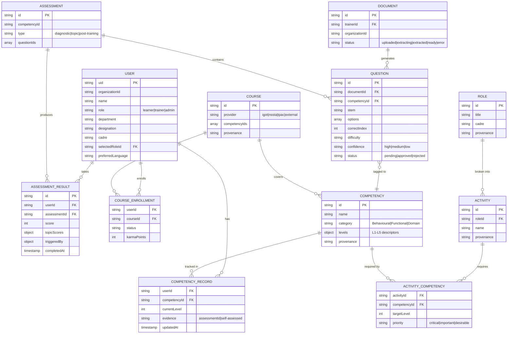

# Product Requirements Document
## StatVidya — Workforce Competency Intelligence Platform for India's Official Statistical System

| Field | Value |
|---|---|
| Document type | Product Requirements Document (PRD) |
| Working title | StatVidya |
| Origin | Ground-up rebuild — supersedes the EduWrap reuse plan |
| Status | Draft v1.0 — ready for review |
| Target program | Smart India Hackathon, Problem Statement **SIH 26101** |
| Owner | *(fill in)* |
| Last updated | *(fill in on first commit)* |

> **Note on scope of this document**: This PRD defines *what* the product must do and *why*, and enough of the data/architecture shape to keep engineering consistent. It intentionally does not prescribe file names, line-by-line tasks, or code — that belongs in an implementation plan derived from this document. Where the source material's implementation plan made a decision that materially affects product behavior (e.g., FRAC alignment, provenance labeling, offline-first for field staff), that decision is preserved and turned into a testable requirement below.

---

## Table of Contents

1. [Executive Summary](#1-executive-summary)
2. [Problem Statement](#2-problem-statement)
3. [Vision & Product Principles](#3-vision--product-principles)
4. [Goals, Non-Goals & Success Metrics](#4-goals-non-goals--success-metrics)
5. [Differentiation Strategy](#5-differentiation-strategy)
6. [Personas](#6-personas)
7. [Scope & Release Milestones](#7-scope--release-milestones)
8. [SIH Requirement Traceability](#8-sih-requirement-traceability)
9. [Domain Grounding — FRAC & Data Provenance Policy](#9-domain-grounding--frac--data-provenance-policy)
10. [Core User Journeys](#10-core-user-journeys)
11. [Functional Requirements](#11-functional-requirements)
12. [Non-Functional Requirements](#12-non-functional-requirements)
13. [Data Model](#13-data-model)
14. [System Architecture](#14-system-architecture)
15. [Security, Privacy & RBAC](#15-security-privacy--rbac)
16. [Analytics & Instrumentation](#16-analytics--instrumentation)
17. [Release Plan](#17-release-plan)
18. [Risks & Mitigations](#18-risks--mitigations)
19. [Assumptions & Dependencies](#19-assumptions--dependencies)
20. [Out of Scope (V1)](#20-out-of-scope-v1)
21. [Open Questions](#21-open-questions)
22. [Appendix](#22-appendix)

---

## 1. Executive Summary

StatVidya is a **competency intelligence platform** for India's Official Statistical System. It sits on top of — not in competition with — **iGOT Karmayogi**, the national learning platform under Mission Karmayogi (10M+ registered users, content in 16 languages). iGOT delivers courses; it does not tell an organization *what a specific official's competency gaps are* or *whether training actually changed field outcomes*. StatVidya fills that layer.

The product runs a closed-loop cycle:

```
Profile → Assess → Gap → Recommend → Learn (via iGOT) → Practice → Reassess → Update → Repeat
```

This cycle is built on **FRAC** (Framework of Roles, Activities and Competencies) — one of the Six Pillars of Mission Karmayogi — rather than an invented taxonomy. That single choice ("we implemented the government's own framework, we didn't invent one") is the platform's credibility anchor and should be the first sentence of any pitch.

Three product bets differentiate StatVidya from the obvious "upload docs → AI makes MCQs → dashboard" interpretation of SIH 26101, which most competing teams will converge on independently:

1. Build for **field personnel** (offline-first, Hindi-first), not just desk officers — the largest, least-served, and hardest-to-demo segment.
2. Connect training to **field outcomes**, not just quiz scores — answer "did training spending work?" not just "did the score go up?"
3. Ground everything in **FRAC**, the government's own methodology, instead of a proprietary skill taxonomy.

This is a from-scratch build. No legacy codebase constraints apply; all technology choices below are recommendations, not inherited decisions.

---

## 2. Problem Statement

India's Official Statistical System (MoSPI, NSSO, ISS/SSS cadre, state DES offices) trains a large, geographically distributed workforce — from headquarters analysts to field enumerators conducting household surveys on tablets. Today:

- There is no systematic way to know **what competencies a given role actually requires** versus what an individual official currently has.
- Training is largely generic and classroom-based; it does not target an individual's or cadre's actual gaps.
- Field investigators — the numerically largest segment — receive dense manuals with minimal interactive practice, work in Hindi, and often have intermittent connectivity; almost no tooling is built around these constraints.
- There is no mechanism connecting "training completed" to "did this improve the quality of statistical output" (e.g., survey data quality). Impact reporting, where it exists, is self-referential (assessment score → level → recommend more training → score goes up).
- Authoring quality assessments from training material is manual and slow, with no standardized way to tag content to competencies.
- Leadership (MoSPI, cadre managers) lacks an aggregate, evidence-based view of workforce capability to plan training investment.

StatVidya addresses these by pairing a FRAC-grounded competency model with an AI-assisted content pipeline and an outcome-oriented intelligence layer, with field-first delivery as a first-class design constraint rather than an afterthought.

---

## 3. Vision & Product Principles

> Build a genuinely useful, extensible workforce learning and competency intelligence platform that solves SIH 26101 well, with a credible path to a larger real-world deployment.

**Product principles** (in priority order when trade-offs arise):

1. **Ground truth over invention.** Where an official framework exists (FRAC, real role designations, real ministries), use it. Where the platform must propose something (specific competencies, scoring formulas, course catalog), label it honestly and make the label visible in the UI — see [§9](#9-domain-grounding--frac--data-provenance-policy).
2. **Field-first, not desk-first.** Every core flow (assessment-taking especially) must work offline and in Hindi before it is considered done — not as a later enhancement.
3. **Close the loop, don't just visualize it.** A feature that shows data but doesn't feed back into a recommendation or an action is lower priority than one that does.
4. **Server enforces, client suggests.** Anything that affects an official's recorded competency level or an assessment score must be computed and written server-side. Client-side role checks are UX only.
5. **Differentiators before defaults.** When time is short, cut generic-but-expected features before cutting the three differentiation levers ([§5](#5-differentiation-strategy)). See the [priority scheme](#7-scope--release-milestones) for how this is enforced, not just stated.

---

## 4. Goals, Non-Goals & Success Metrics

### 4.1 Goals

- G1: Give every official a FRAC-grounded, individualized view of their competency gaps and a ranked path to close them.
- G2: Let trainers turn existing training documents into a reviewed, competency-tagged question bank in minutes, not days.
- G3: Give organizational leadership an honest (not fabricated) view of workforce readiness and one concrete action to take on it.
- G4: Serve field personnel (offline, Hindi) as a first-class, not secondary, experience.
- G5: Establish, even in a simulated form, a link between training and real-world statistical output quality.
- G6: Present a system whose provenance is always inspectable — nothing is presented as government-verified truth unless it actually is.

### 4.2 Non-Goals (for this product, at any stage covered by this PRD)

- Not a general-purpose LMS / course-hosting platform (iGOT already does this).
- Not a chatbot-first product — the AI assistant is one grounded capability among several, not the core interface.
- Not an HR performance-management or disciplinary tool. Self-assessed weaknesses must never be positioned as appraisal input beyond what APAR/Karma Points integration already implies.
- Not attempting real-time iGOT API integration in V1 (no public API exists at time of writing — see [§11.6](#116-igot-integration)).

### 4.3 Success Metrics

The original plan had no explicit success metrics — these are added to make "done" and "working" measurable rather than purely feature-checklist-based.

| Category | Metric | Target (early / pilot stage) |
|---|---|---|
| Activation | % of new users completing onboarding + initial self-assessment in first session | ≥ 70% |
| Core loop health | % of identified **high-severity** gaps that drop at least one severity tier within 60 days of a recommendation being acted on | Track from first cohort; no target until baseline exists |
| Engagement | Average assessments taken per active learner / month | ≥ 1 |
| Recommendation efficacy | % of recommended courses actually started within 14 days | ≥ 30% |
| Content pipeline quality | % of AI-generated MCQs approved without edit | ≥ 60% (proxy for prompt quality; track by confidence tier) |
| Content pipeline efficiency | Median trainer review time per question | ↓ over time (baseline in Phase 3) |
| Reliability | Offline assessment sync success rate on reconnect | ≥ 99% |
| Reliability | Assessment submission → competency record update success rate | ≥ 99.5% |
| Differentiator adoption | % of Field Investigator persona sessions that use Hindi UI and/or complete an assessment offline | Reported, not gated — this is the metric that proves Lever 1 is real, not a demo trick |
| Admin engagement | % of admin sessions resulting in at least one write-back action (e.g., "flag for priority training") | Reported from first pilot org |
| Trust | % of domain-data UI surfaces rendering a provenance badge (should be 100% — see §9) | 100% (build-time lint check, not just manual QA) |

These metrics should be wired into analytics from Phase 1 (see [§16](#16-analytics--instrumentation)), not bolted on later.

---

## 5. Differentiation Strategy

> The blunt reality: "upload docs → AI generates MCQs → map to competencies → show gaps → recommend iGOT courses → admin dashboard" is the obvious reading of SIH 26101. Every competent team converges on it independently, because the problem statement effectively hands it to you. Executing it well is necessary but not sufficient — an excellent version of the expected thing still loses to a mediocre version of the unexpected thing.

Three levers, in priority order:

**Lever 1 — Field personnel, not desk officers.** The Field Investigator / Primary Enumerator (NSSO Field Operations Division) is the largest workforce segment, the one where competency gaps have the most measurable downstream cost (bad sampling → bad national statistics), and the one other teams are least likely to build for, because offline-first + Hindi-first is harder to build *and* harder to demo than another chat UI. This must be a first-class persona, not a footnote.

**Lever 2 — Training → field outcomes, not self-referential scores.** A pipeline where "assessment score → competency level → recommend course → score goes up" never touches whether anything real improved is internally consistent but hollow. Connecting competency levels to even a *simulated* survey-quality metric reframes the product from "another LMS" to "evidence that training spending works" — which is the question a funding body actually asks.

**Lever 3 — FRAC grounding, not an invented taxonomy.** Nearly every competing team will invent its own skill taxonomy because researching Mission Karmayogi's actual methodology takes real effort under time pressure. "We implemented the government's own framework" is a stronger opening line than any UI polish.

**Enforcement mechanism** (this is the improvement over the source plan, which stated the rule but gave no mechanism): every functional requirement in [§11](#11-functional-requirements) below is tagged **P0 / P1 / P2**. Nothing tagged P2 may consume engineering time while any P0 item tied to Levers 1–3 is incomplete. If a schedule crunch forces a cut, cut P2 first, then P1, and treat cutting a Lever 1–3 P0 item as requiring explicit, logged sign-off — not a default fallback.

---

## 6. Personas

### 6.1 Learner — Field Investigator (⭐ Primary persona)

**Who**: Field Investigator / Primary Enumerator, NSSO Field Operations Division, conducting PLFS/ASI/ASUSE/agricultural surveys on CAPI tablets. Works with intermittent connectivity, primarily in Hindi, on tablets rather than laptops. The largest segment of the statistical workforce, and the one where a competency gap has the most direct downstream cost.

**Goals**: Know exactly which competencies their role requires; take assessments that work without reliable connectivity; see content in Hindi by default; trust that a poor self-assessment won't be held against them.

**Pain points today**: dense manuals with no interactive practice; tooling assumes laptop + broadband; no feedback loop from training to whether it actually helped in the field.

### 6.2 Learner — Desk Officer

**Who**: Junior/Senior Statistical Officer, Deputy Director (ISS), System Analyst — MoSPI HQ, CSO, or State DES.

**Goals**: Understand FRAC-mapped competency requirements for their specific role; get tailored (not generic) recommendations linked to iGOT with Karma Points tracking; track APAR-readiness over time.

### 6.3 Trainer

**Who**: NSSTA/TPAC faculty, subject-matter experts, senior officials authoring training material.

**Goals**: Turn existing documents into quality assessments quickly; maintain control over AI-generated content; build a reusable, competency-tagged question bank; see whether their material actually closes gaps.

**Pain points today**: writing good MCQs is slow; no standard way to tag questions to competencies; no visibility into downstream effectiveness.

### 6.4 Administrator

**Who**: Department heads, HR/capacity-building managers, MoSPI leadership.

**Goals**: See workforce competency levels in aggregate; identify departments/roles with critical gaps; get an honest read on training effectiveness; act on findings, not just view them.

**Pain points today**: no aggregate view; no cross-department comparison; training budget decisions aren't data-driven.

---

## 7. Scope & Release Milestones

Priority tags used throughout §11:

| Tag | Meaning |
|---|---|
| **P0** | Required for MVP / hackathon demo. Includes every Lever 1–3 differentiator by design — these are not optional even though they'd traditionally be "stretch." |
| **P1** | Required to close the full product loop end-to-end (V1, post-demo hardening). |
| **P2** | Valuable but explicitly deferrable; the first thing cut under time pressure. |

### Milestone map

| Milestone | Contains | Rough scope of source plan's phases |
|---|---|---|
| **MVP (demo-ready)** | Auth/RBAC, FRAC-aligned domain data with provenance labels, competency profile + gap analysis, adaptive assessment (basic), recommendation engine, iGOT mock adapter, minimal AI MCQ pipeline, offline assessment flow, Hindi-first field UI, one honest admin screen, outcome-correlation chart (simulated) | Phases 1–3 (P0 subset) + selected P0 items from 2/5 |
| **V1 (complete core loop)** | Full trainer content pipeline with confidence-sorted review, role dashboards, AI assistant (context-grounded), admin narrative summaries + write-back action, competency history | Phases 3–5 (remaining P1 items) |
| **V1.1 (hardening)** | E2E integration polish, accessibility pass, error boundaries, observability, security rule audit | Phase 6 |
| **V2 (post-pilot)** | Skill gap heatmap, training effectiveness (real pre/post data), demand forecasting, semantic search/RAG, live iGOT integration (pending gov credentials), certifications, cohorts, real SSO, relational analytics DB | Phase 7 + "FUTURE" table |

---

## 8. SIH Requirement Traceability

| SIH 26101 Requirement | Verification | Platform Feature | Milestone | Priority |
|---|---|---|---|---|
| AI-powered competency gap identification | ✅ Core requirement | Skill Gap Analysis Engine (FRAC-aligned) | MVP | P0 |
| Integration with iGOT Karmayogi ecosystem | ✅ Core requirement | iGOT Adapter (mock + documented live-mode contract, Karma Points/APAR tracking, deep links) | MVP (mock) / V2 (live) | P0 / P2 |
| Personalized training recommendations | ✅ Core requirement | Recommendation Engine + Learning Pathways | MVP | P0 |
| Auto-generate MCQs from training materials | ✅ Core requirement | Document → MCQ pipeline (batch generation, confidence tagging) | MVP (basic) / V1 (full review UX) | P0 / P1 |
| Focus on India's Official Statistical System | ✅ Domain context | MoSPI/ISS/SSS/NSSO domain data, NSSTA curriculum | MVP | P0 |
| Adaptive learning & dynamic difficulty | ✅ Core requirement | Multi-stage dynamic assessment branching to estimate L1–L5 | MVP | P0 |
| Virtual assistance / AI copilot | ⚠️ Mentioned | AI Learning Assistant (5 capabilities, §11.8) | MVP (2 capabilities) / V1 (all 5) | P0 (subset) / P1 |
| Multilingual support (Hindi/English) | ⚠️ Mentioned, but treated as vital given field-staff reality | i18n framework, Hindi-first field flow | MVP | P0 |
| Virtual labs for statistical practice | ⚠️ Mentioned | Statistical practice sandbox | V2 | P2 |
| Security & Gov SSO (Parichay/MeriPehchaan) | ⚠️ Mentioned | Firebase Auth + simulated Parichay SSO now; real SSO path documented | MVP (simulated) / V2 (real) | P0 / P2 |
| Workforce analytics & cadre forecasting | ⚠️ Mentioned | Org overview + AI narrative + write-back now; forecasting later | MVP (overview) / V2 (forecasting) | P0 / P2 |

> **Confirmed constraint**: iGOT Karmayogi has no public API documentation or developer portal at time of writing. Integration requires official authorization via `mission.karmayogi@gov.in`. The mock adapter should follow the **DSEP Protocol / Sunbird conventions** where plausible, but must never be presented as a confirmed integration — see §11.6.

---

## 9. Domain Grounding — FRAC & Data Provenance Policy

### 9.1 What is FRAC

FRAC (Framework of Roles, Activities and Competencies) is one of the Six Pillars of Mission Karmayogi. It deconstructs every government position into:

1. **Role** — a named position (e.g., Junior Statistical Officer).
2. **Activity** — a discrete work function within that role (e.g., "Conduct large-scale sample surveys").
3. **Competency** — a specific skill/knowledge area needed for the activity, classified as **Behavioural** (leadership, communication, ethics — common across government), **Functional** (job-family-specific, e.g., project management), or **Domain** (role-specific technical expertise, e.g., survey sampling design).

Competencies sit under the **ASK model** (Attitude, Skill, Knowledge) and are assessed on a five-level proficiency scale.

### 9.2 How StatVidya aligns

| Aspect | FRAC Official | StatVidya |
|---|---|---|
| Structure | Role → Activity → Competency | Mirrored exactly in the data model (§13) |
| Categories | Behavioural / Functional / Domain | Used as-is; statistical competencies live under Functional/Domain |
| Proficiency scale | Five levels | L1–L5, consistent with FRAC guidance; specific descriptors are our proposal |
| Population method | Departmental FRACing Team runs a formal exercise | In this product, the team proposes mappings; a real deployment would use MoSPI's own FRACing Team output |
| Competency/position dictionaries | Central dictionaries maintained by iGOT | Demo uses proposed dictionaries; real deployment would sync with official ones |

### 9.3 Provenance labeling policy (enforceable requirement, not just a UI convention)

This is the single most important trust mechanism in the product and is elevated here from a documentation note (in the source plan) to a first-class functional requirement — see **FR-TRUST-1** in §11.1.

Every record that carries domain data (competency, role, activity, course, organizational aggregate) **must** carry a `provenance` field with one of three values, and the UI **must** render a badge derived from that field — never from developer memory:

| Label | Meaning | Applies to |
|---|---|---|
| ✅ `VERIFIED_OFFICIAL` | Matches a real, checkable government fact or structure | FRAC's Role→Activity→Competency structure; real role titles (JSO, SSO); MoSPI/NSSTA as institutions; iGOT's existence and scale |
| ⚠️ `PROPOSED_FRAMEWORK` / `PROPOSED_METHODOLOGY` | Structurally grounded in something official, but the specific content is the product team's proposal | Specific competency list, level descriptors, Activity→Competency mappings, gap-severity formula, readiness index formula, recommendation scoring |
| 🟡 `SYNTHETIC_DEMO_DATA` | Fabricated for demonstration; no claim to real-world accuracy | Course catalog, iGOT course data, sample questions, mock organization aggregates |

**Acceptance test**: a linter/build check should be able to walk the seeded domain data and confirm 100% of competency/role/activity/course records have a non-null `provenance` field before any release build is considered demo-ready.

---

## 10. Core User Journeys

### 10.1 Learner journey

```
Sign up / Login → Onboarding (role, org details, select government role, initial self-assessment)
  → Dashboard (readiness index, top gaps, next actions)
  → Skill Gap Analysis (current vs. required level, priority-weighted severity, verified vs. self-assessed badges)
  → Learning Pathways (ranked recommendations, "why this," iGOT deep links)
  → Take Assessment (adaptive difficulty, timer, flag-question control, offline-capable)
  → Results & Impact (score, topic breakdown, competency level update, revised gaps, new recommendations)
  → Repeat
```

### 10.2 Trainer journey

```
Login → Upload document (drag-drop, page-range selection for large PDFs)
  → Configure generation (count, difficulty, target competency)
  → AI generates questions (batched, confidence-tagged)
  → Competency validation sanity check ("these questions reference X, Y, Z — does that match the competency you picked?")
  → Review queue (low-confidence first) → Approve / Edit / Reject
  → Publish to Question Bank
  → Monitor performance (error rates, learner flags) to refine future uploads
```

### 10.3 Administrator journey

```
Login → Organization overview (headcount, average readiness, trend, AI narrative summary)
  → Role/department breakdown table → drill into individuals
  → Flag a department for priority training (write-back action, logged and visible to other admins)
```

---

## 11. Functional Requirements

Each requirement has an ID, priority, and acceptance criteria. IDs are stable identifiers for use in tickets/tests.

### 11.1 Foundation — Auth, RBAC, Organization Model

| ID | Requirement | Priority | Acceptance Criteria |
|---|---|---|---|
| FR-AUTH-1 | Users authenticate via email/password or Google OAuth | P0 | Login/signup succeeds; session persists across reload |
| FR-AUTH-2 | Simulated government SSO ("Parichay") login with pre-seeded demo personas | P0 | One-click login as a named persona (e.g., "JSO Amit Sharma") works without manual credential entry |
| FR-AUTH-3 | Signup restricted to plausible government email domains, with a demo-mode override flag | P1 | Non-listed domains are rejected unless `DEMO_MODE=true` |
| FR-RBAC-1 | Three roles exist: learner, trainer, admin, each with role-appropriate navigation | P0 | Switching role changes visible nav items; unauthorized routes are inaccessible |
| FR-RBAC-2 | Client-side role guards are documented as UX-only; **all** authorization-sensitive writes are enforced server-side | P0 | A tampered client (e.g., editing local state) cannot write data the server-side rule set would reject |
| FR-ORG-1 | Every user, competency record, document, question, assessment result, and course is scoped by `organizationId` from day one | P0 | Cross-org data leakage is impossible even before multi-tenant UI exists |
| FR-TRUST-1 | Every UI surface displaying competency, role, activity, course, or organizational-aggregate data renders a provenance badge sourced from the record's `provenance` field | P0 | Automated check confirms no domain-data record is missing `provenance`; manual QA confirms badges render correctly on Profile, Skill Gap, Learning Pathways, Admin Overview |

### 11.2 Onboarding & Profile

| ID | Requirement | Priority | Acceptance Criteria |
|---|---|---|---|
| FR-ONB-1 | Multi-step onboarding: role selection → official details (name, dept, designation, cadre) → select government role from catalog → initial self-assessment (L1–L5 per competency) | P0 | New user reaches dashboard with a populated (if minimal) competency profile |
| FR-ONB-2 | Field Investigator persona defaults to Hindi locale during onboarding | P0 | FI demo persona's onboarding renders in Hindi without manual toggle |
| FR-PROFILE-1 | Profile displays competency radar, Karma Points counter, and APAR milestone gauge | P1 | All three elements render with live (not hardcoded) data once a competency record exists |
| FR-PROFILE-2 | Profile visually distinguishes 🛡️ assessment-verified levels from ✍️ self-assessed levels | P0 | Every competency level shown anywhere in the product carries one of these two badges — never ambiguous |
| FR-PROFILE-3 | Profile shows competency growth history over time | P1 | A learner who has taken 2+ assessments sees a timeline, not just a current snapshot |

### 11.3 Competency & Gap Analysis

| ID | Requirement | Priority | Acceptance Criteria |
|---|---|---|---|
| FR-COMP-1 | Gap severity is computed as `severityScore = (targetLevel − currentLevel) × priorityWeight`, where critical=3, important=2, desirable=1 | P0 | A Δ=1 gap on a critical competency ranks above a Δ=2 gap on a desirable competency (unit test required) |
| FR-COMP-2 | Severity buckets: `severityScore ≥ 4 → HIGH 🔴`, `2–3 → MODERATE ⚠️`, `≤1 → PROFICIENT ✅` | P0 | Gap cards render the correct bucket for known inputs |
| FR-COMP-3 | Workforce Readiness Index is computed per user as a function of gap closure across their FRAC-required competencies | P0 | Returns 100% when all competencies meet or exceed target; unit test required |
| FR-COMP-4 | Skill Gap page orders gaps by severity score, referencing the specific FRAC Activity driving the requirement | P0 | Highest-severity gap always appears first; each card names the Activity, not just the Competency |
| FR-COMP-5 | Severity weights and readiness-index formula are configurable per organization without a code change | P1 | Changing a weight in configuration changes computed severities on next load, no redeploy |
| FR-COMP-6 | "Explain-the-gap" AI narrator produces a one-line, FRAC-referenced explanation per gap card | P1 | Explanation names the specific Activity and Competency, not a generic "Level 1 → Level 3" |

### 11.4 Adaptive Assessment Engine

| ID | Requirement | Priority | Acceptance Criteria |
|---|---|---|---|
| FR-ASSESS-1 | Assessment starts at medium difficulty and branches (harder on correct, easier on incorrect) to converge on an estimated L1–L5 level with fewer questions than a fixed-length test | P0 | Given a scripted answer sequence, the engine converges to the expected level in unit tests |
| FR-ASSESS-2 | Assessment UI supports timer, question navigation, and a "flag this question" control on every question | P0 | Flags are persisted and visible to trainers in the review/monitoring view |
| FR-ASSESS-3 | Assessment questions can render bilingually (English/Hindi), with pre-authored (not machine-translated at runtime) stems for at least the survey-sampling domain | P0 | At least 10 questions have authentic Hindi stems; toggle switches rendering without reload |
| FR-ASSESS-4 | Assessment submission is validated and scored **server-side**; the client cannot fabricate a score | P0 | Tampering with client-side answer state does not change the persisted score |
| FR-ASSESS-5 | Completing an assessment updates the user's `competency_records`, creates an `assessment_result`, and writes an audit log entry, atomically from the server's perspective | P0 | A completed assessment always leaves the record set in a consistent state, even on partial client failure (verified via retry/idempotency test) |
| FR-ASSESS-6 | Post-assessment micro-feedback: a short, specific explanation of likely reasons for missed topics, linked to a specific course/chunk | P1 | Feedback references the actual missed topic and a real linked resource, not generic praise/criticism |
| FR-OFFLINE-1 | A learner can cache an assessment for offline use, complete it fully offline, and have results queue for sync | P0 | Assessment completed in airplane mode is not lost; UI shows a persistent "results will sync when connected" indicator |
| FR-OFFLINE-2 | On reconnect, queued results sync automatically and the server-side scoring/competency-update pipeline runs exactly as it would online | P0 | After reconnect, competency record reflects the offline-completed assessment within a defined sync window (target: <30s after connectivity restored) |
| FR-OFFLINE-3 | Offline status is visibly indicated at all times during an assessment (online / cached-offline / pending sync), in the user's active language | P0 | Indicator state matches actual connectivity and queue state in manual test |

### 11.5 Recommendation Engine & Learning Pathways

| ID | Requirement | Priority | Acceptance Criteria |
|---|---|---|---|
| FR-REC-1 | Courses are ranked by a documented multi-signal formula (gap severity, role priority, difficulty match, prerequisite readiness) | P0 | Ranking is reproducible for known inputs (unit test); formula weights are visible in code/config, not implicit |
| FR-REC-2 | Every recommendation includes a human-readable "why this was recommended" explanation | P0 | No recommendation card ships without an explanation string |
| FR-REC-3 | Recommended courses show a pathway structure (foundational → applied → capstone) where applicable | P1 | At least one competency has a 3-stage pathway in seed data |
| FR-REC-4 | Course cards deep-link directly to the corresponding live iGOT Karmayogi course page where a real URL exists | P0 | Links resolve to real `igotkarmayogi.gov.in` pages, not placeholders, wherever the catalog has a real mapping |

### 11.6 iGOT Integration

| ID | Requirement | Priority | Acceptance Criteria |
|---|---|---|---|
| FR-IGOT-1 | An adapter interface (`searchCourses`, `getCourse`, `getCompetencyMapping`, `getKarmaPoints`, `syncEnrollmentProgress`, `enrollUser`) is defined once and implemented by a mock provider now | P0 | Swapping the mock implementation for a future live implementation requires no change to any calling code |
| FR-IGOT-2 | Mock mode reads from a locally seeded, explicitly `SYNTHETIC_DEMO_DATA`-labeled course catalog, including Karma Points values | P0 | UI clearly states "Integration: Demo Mode — connected to local course catalog" wherever iGOT data is shown |
| FR-IGOT-3 | The live-mode contract is documented (even though unimplemented) so a future integrator has a concrete target, informed by DSEP Protocol / Sunbird conventions where plausible | P1 | A written adapter-contract doc exists and is referenced from code comments |
| FR-IGOT-4 | Outreach to `mission.karmayogi@gov.in` is tracked as a product artifact (not just a to-do), and its status is reflected in any pitch/demo material | P1 | A dated record of the outreach (sent/response/no-response) exists and is referenced in demo material if sent |

### 11.7 Content Intelligence Pipeline

| ID | Requirement | Priority | Acceptance Criteria |
|---|---|---|---|
| FR-CONTENT-1 | Trainer can upload PDF/DOCX documents with a page-range or chapter selector to avoid client-side memory issues on large files | P0 | A 200+ page document does not freeze the browser; only the selected range is processed |
| FR-CONTENT-2 | Text extraction with OCR fallback for scanned pages | P0 | A scanned (image-only) PDF still yields extractable text |
| FR-CONTENT-3 | Text is chunked with section/heading awareness, preserving page/section metadata | P1 | Generated questions can cite a specific source section, not just "the document" |
| FR-CONTENT-4 | AI generates MCQs in a single batched request per generation job (not one request per question), respecting the active AI provider's rate limits | P0 | A batch of 10–15 MCQs is requested and returned in one call; provider rate limits are never exceeded in normal operation |
| FR-CONTENT-5 | Each generated question carries a `confidence: high|medium|low` self-assessment from the AI (ambiguous stem, multiple plausible answers, mismatched explanation, etc.) | P0 | Confidence tag is present and used to sort the review queue |
| FR-CONTENT-6 | A trainer-facing sanity check appears between generation and full review: "these questions reference topics X, Y, Z — does this match the competency you selected?" | P0 | Trainer must confirm or adjust the competency tag before entering the per-question review queue |
| FR-CONTENT-7 | Review queue is sorted low-confidence-first; trainer can approve, edit, or reject each question, with bulk-approve available for high-confidence items | P0 | Trainer can clear a batch of 12 questions in a single sitting without re-sorting manually |
| FR-CONTENT-8 | Approved questions immediately become available to the assessment engine's question bank | P0 | A newly approved question can be drawn into a live assessment without any manual sync step |
| FR-CONTENT-9 | A rule-based fallback question generator activates automatically if the AI provider is unavailable or over quota | P0 | Simulating an AI outage still produces usable (if simpler) questions |
| FR-CONTENT-10 | Every AI-content event (generation, approval, edit, rejection) is written to an immutable audit log with prompt version | P1 | Audit log entries exist for each action and cannot be edited or deleted through the app |
| FR-CONTENT-11 | Trainer sees basic performance monitoring on their published questions (error rate, learner flags) | P1 | A question with an unusually high error rate or multiple flags is visibly surfaced to the trainer |

### 11.8 AI Learning Assistant

Five concrete, context-grounded capabilities — deliberately not a generic chatbot.

| ID | Requirement | Priority | Acceptance Criteria |
|---|---|---|---|
| FR-AI-1 | **Gap-aware conversational assistant**: every response is grounded server-side in the learner's actual competency records, role's FRAC requirements, and assessment history, injected into the system prompt before the model call | P1 | Assistant answers reference the learner's real gaps without the learner re-explaining their role or level |
| FR-AI-2 | **Trainer co-pilot for question quality**: confidence tagging described in FR-CONTENT-5, surfaced as a triage aid, not a black box | P0 | Same as FR-CONTENT-5's acceptance criteria |
| FR-AI-3 | **Explain-the-gap narrator**: see FR-COMP-6 | P1 | Same as FR-COMP-6 |
| FR-AI-4 | **Post-assessment micro-feedback**: see FR-ASSESS-6 | P1 | Same as FR-ASSESS-6 |
| FR-AI-5 | **Admin narrative summaries**: 2–3 sentence plain-language summary of the biggest workforce gap trend, useful even with sparse data | P1 | Narrative references real (even if small) aggregate numbers, not filler text |

### 11.9 Workforce Intelligence (Admin)

| ID | Requirement | Priority | Acceptance Criteria |
|---|---|---|---|
| FR-ADMIN-1 | Organization overview: total officials, average readiness, trend direction | P0 | Numbers are computed from real seeded data, not hardcoded |
| FR-ADMIN-2 | AI-generated narrative summary of the top gap trend (see FR-AI-5) | P1 | Present on the admin landing view |
| FR-ADMIN-3 | Role/department breakdown table with drill-down to individual (subject to RBAC + org scoping) | P0 | Admin can view a department's aggregate and click into an individual's profile within the same org |
| FR-ADMIN-4 | Admin can flag a department/role for priority training — a real write-back action, not just a view | P0 | Flagging persists (`trainingPriority: { flagged, reason, flaggedBy, flaggedAt }`) and is visible to other admins in the org |
| FR-ADMIN-5 | Training → outcome correlation view: competency level vs. a simulated survey-quality metric, scatter plot with trend line, clearly labeled `SYNTHETIC_DEMO_DATA` with a stated methodology note and integration path to a real metric source | P0 | Chart renders with a visible "Simulated" watermark and a one-line methodology note; no simulated number is presented without that label |
| FR-ADMIN-6 | Skill Gap Heatmap (departments × competencies matrix) | P2 | Deferred to V2; only attempt if V1 scope is otherwise complete |
| FR-ADMIN-7 | Training effectiveness (real before/after comparison) | P2 | Deferred to V2 — requires real longitudinal data not available pre-pilot |
| FR-ADMIN-8 | Demand forecasting | P2 | Deferred to V2 |

### 11.10 Offline, PWA & Multilingual

| ID | Requirement | Priority | Acceptance Criteria |
|---|---|---|---|
| FR-PWA-1 | App is installable as a PWA (manifest + service worker caching the app shell) | P0 | Chrome/Edge shows an "Install app" prompt |
| FR-PWA-2 | Assessment-taking route and pre-fetched question data are cached by the service worker for offline use | P0 | See FR-OFFLINE-1/2/3 |
| FR-I18N-1 | i18n is implemented as a real framework (e.g., namespaced locale files + a translation library), not a single hardcoded dictionary — architecture should read as "built for India's scheduled languages," not "two hardcoded strings" | P0 | Adding a third language requires only a new locale file, no code changes to components |
| FR-I18N-2 | Navigation, competency names, role names, and assessment UI strings are translated for at least English and Hindi at launch | P0 | Full navigation and assessment flow renders correctly in both languages |
| FR-I18N-3 | A visible language toggle exists in the header, and a user/persona-level `preferredLanguage` sets the default without requiring the toggle every session | P0 | Field Investigator persona defaults to Hindi; toggle switches to English and back without reload artifacts |

### 11.11 Notifications & Communication

| ID | Requirement | Priority | Acceptance Criteria |
|---|---|---|---|
| FR-NOTIF-1 | In-app notification list (already-existing pattern: new recommendation, assessment result, review reminder) | P1 | Notifications appear and can be marked read |
| FR-NOTIF-2 | Push/email notifications | P2 | Deferred to V2 |

---

## 12. Non-Functional Requirements

| Category | Requirement |
|---|---|
| **Performance** | Dashboard initial load < 3s on a typical 4G connection. Cached PWA shell load < 5s on first offline load. Worker/API P95 latency < 800ms for non-AI endpoints. Batched AI MCQ generation (10–15 questions) completes in < 20s under normal provider load. |
| **Availability** | Target 99% uptime during any active demo/pilot window. No formal SLA is committed pre-pilot; this is a design target, not a contractual one. |
| **Scalability** | Architecture must not require rework to go from single-digit pilot users to ~10,000 users within one organization. Multi-tenancy (`organizationId` scoping) must exist from the first schema, not be retrofitted. |
| **Accessibility** | WCAG 2.1 AA minimum for all learner-facing core flows (onboarding, dashboard, gap analysis, assessment-taking). Keyboard navigation and visible focus states required on all interactive elements. |
| **Localization** | English and Hindi at launch; architecture must support adding any of India's scheduled languages without code changes (see FR-I18N-1). |
| **Security** | No AI provider API key ever ships in a client bundle. All writes to competency records and assessment results are server-validated. See §15 for the full threat model. |
| **Data integrity** | Assessment scoring must be deterministic and reproducible from stored answers; a re-run of the scoring function against stored data must always yield the same result. |
| **Observability** | Every AI content event, every competency-record write, and every admin write-back action is logged to an append-only audit trail. Errors are caught by boundary components with a user-visible, non-technical message. |
| **Data retention** | Configurable per organization; default minimum audit log retention of 12 months. Self-assessed data must be clearly separated (see §15.3) from verified data in storage, not just in the UI. |
| **Browser/device support** | Must function acceptably on a mid-range Android tablet in a 3-bar-signal environment — this is the actual target device for the primary persona, not an edge case. |

---

## 13. Data Model

### 13.1 Core entities (conceptual — see ERD)



### 13.2 Field notes worth calling out explicitly

- `provenance` appears on `COMPETENCY`, `ROLE`, `ACTIVITY`, and `COURSE` — this is the field FR-TRUST-1 depends on. It should be a required, non-nullable field at the schema level, not a convention.
- `COMPETENCY_RECORD` and `ASSESSMENT_RESULT` are **not** writable by the client directly (see §15) — only by a trusted server-side process.
- `USER` does **not** store `competencyProfile` inline; competency data lives in the separate, protected `COMPETENCY_RECORD` collection so that a broad "read own profile" grant never accidentally exposes writable competency data.
- `ASSESSMENT_RESULT.triggeredBy` (`{ type: 'diagnostic'|'post-course'|'retake', courseId? }`) exists specifically to support Lever 2 (training→outcome correlation) later — don't drop this field even if the correlation feature is deferred, since retrofitting it after real assessment data exists is far more expensive than including it from day one.

---

## 14. System Architecture

### 14.1 High-level layers

```
┌─────────────────────────────────────────────┐
│ PRESENTATION LAYER                           │
│ Web app (role-aware pages) + PWA shell        │
├─────────────────────────────────────────────┤
│ SERVICE LAYER (framework-agnostic modules)   │
│ CompetencyService · AssessmentService        │
│ RecommendationService · ContentService       │
│ AIService (provider-agnostic) · StorageService│
│ IntegrationService (iGOT adapter)             │
├─────────────────────────────────────────────┤
│ DATA LAYER                                   │
│ Auth · Primary document DB · Object storage   │
│ Client-side cache for offline content         │
├─────────────────────────────────────────────┤
│ EXTERNAL SERVICES                            │
│ Serverless proxy (auth-validated, rate-limited)│
│ AI provider (primary + fallback)              │
│ iGOT Karmayogi (mock now; live path documented)│
└─────────────────────────────────────────────┘
```

**Key architectural decisions, and why they're recommended (not just inherited):**

| Decision | Recommendation | Rationale |
|---|---|---|
| Service layer independence | Services are plain modules with no framework dependency; UI consumes them via context/providers | Lets any service move server-side later without touching the presentation layer |
| Server-side AI proxy | All AI calls route through a small serverless function that validates the user's auth token and enforces per-user rate limits before forwarding to the provider | A client-side AI key is a guaranteed quota-burn/cost incident; this is non-negotiable, not a nice-to-have |
| AI provider strategy | One high-quality provider as primary, one lower-quality/open-source provider as automatic fallback, plus a rule-based offline fallback | Rate limits and outages are a "when," not "if" — see FR-CONTENT-9 |
| Primary database | A single document-oriented database with real-time listeners and native auth integration | Minimizes infrastructure for a small team; a relational layer is explicitly a **future** optimization for analytics, not a day-one requirement |
| Large file storage | Object storage optimized for large PDFs with a presigned-URL upload pattern (browser uploads directly, bytes never transit the proxy) | Avoids bandwidth costs and timeout risk in the proxy function |
| Offline cache | Client-side structured storage (e.g., IndexedDB) for cached assessment content and a pending-results queue | Required for FR-OFFLINE-1/2/3 — this cannot be an afterthought given Lever 1 |
| Security enforcement | Client-side role guards are UI-only; all writes to protected collections go through server-validated rules or a trusted server-side function | See §15 |

### 14.2 Upload flow (presigned URL pattern)

```
Browser --(1. request signed upload URL, authenticated)--> Serverless function
Serverless function --(2. validate auth, check size/type, sign URL)--> (returns URL)
Browser --(3. direct PUT upload)--> Object storage
Browser --(4. confirm metadata)--> Primary database
```

### 14.3 AI proxy flow

```
Browser --(1. request + auth token)--> Serverless proxy
Proxy --(2. validate token, check per-user rate limit, select provider)--> AI provider
AI provider --(3. response)--> Proxy
Proxy --(4. validate + log usage)--> Browser
```

---

## 15. Security, Privacy & RBAC

### 15.1 Threat model

| Threat | Mitigation | Enforced by |
|---|---|---|
| Client bypasses UI role guard to access trainer/admin views | Role guards are documented as UX-only; underlying data access is independently checked | Server-side rule set / trusted function, not the guard component |
| Client fabricates an assessment score or competency level | All scoring and competency-record writes happen server-side against stored correct answers | Server-side write path; client has read-only or no direct write access to these collections |
| Leaked AI provider API key in client bundle | No AI key ever exists client-side; all AI calls proxy through an authenticated, rate-limited server function | Server-side secret storage |
| Cross-organization data leakage | Every relevant collection is scoped by `organizationId`; access rules check the requester's own org membership | Server-side rule set from day one, not retrofitted |
| Immutable audit trail tampering | Audit log entries are append-only; update/delete are always denied at the rule level | Server-side rule set |
| Self-assessed weaknesses used punitively | Explicit product policy (not just a technical control): self-assessment is for learning recommendations, not appraisal; UI states this; admin-level individual drill-down requires explicit admin role within the same org | RBAC + written policy communicated in-product |

### 15.2 Two-layer authorization

1. **Client-side guards** — hide/show UI elements based on role. UX convenience only; never trusted for security.
2. **Server-side rules / trusted functions** — the actual enforcement layer. Any collection holding competency levels, assessment results, or org-sensitive data denies direct client writes; writes happen only through a validated, server-side path that recomputes the result rather than trusting client-submitted values.

### 15.3 Data sensitivity

Competency data tied to an identifiable government employee is HR-adjacent and sensitive:

- Individual-level competency data is **not** automatically visible to admins beyond aggregate/org-level views unless the admin's role explicitly grants drill-down access within the same organization.
- Self-assessed levels must be visually and structurally distinct from verified levels (FR-PROFILE-2) precisely because an official admitting a Level 1 in a critical skill should not fear it being read as a performance judgment.
- A real deployment requires a formal data-classification exercise (retention periods, who can see what) — this is a policy decision the RBAC/rule infrastructure should already be capable of enforcing once made.

### 15.4 Role definitions

| Role | Access |
|---|---|
| `learner` | Own profile, own assessments, own courses/pathways, AI assistant |
| `trainer` | Everything a learner has, plus document upload, MCQ generation, question review, question bank, content-level performance monitoring |
| `admin` | Everything a trainer has, plus organization analytics, role/department drill-down (within org), write-back actions, user management |

---

## 16. Analytics & Instrumentation

To make §4.3's success metrics real rather than aspirational, instrument the following events from Phase 1 onward:

| Event | Captures |
|---|---|
| `onboarding_completed` | time to complete, role selected, language selected |
| `gap_viewed` | competency id, severity bucket, verified vs self-assessed |
| `recommendation_shown` / `recommendation_started` | course id, ranking score, time-to-start |
| `assessment_started` / `assessment_completed` | mode (online/offline), duration, adaptive path taken |
| `offline_assessment_queued` / `offline_sync_completed` | queue duration, sync latency, success/failure |
| `question_generated` / `question_reviewed` | confidence tag, review outcome (approve/edit/reject), review duration |
| `admin_writeback_action` | action type, target department/role |
| `provenance_badge_rendered` | surface, label — used to validate the 100% coverage target in §4.3 |

These events should feed a lightweight internal dashboard before any external reporting is built — visibility into the core loop's health is itself a Phase 1–2 deliverable, not a "nice to have later."

---

## 17. Release Plan

This condenses the source plan's seven phases into the milestone structure from §7, with priority tags carried through. Detailed task breakdown belongs in a separate implementation plan derived from this PRD; this section states scope and acceptance per milestone only.

### MVP (demo-ready)
**Scope**: FR-AUTH-1/2, FR-RBAC-1/2, FR-ORG-1, FR-TRUST-1, FR-ONB-1/2, FR-PROFILE-2, FR-COMP-1–4, FR-ASSESS-1–5, FR-OFFLINE-1–3, FR-REC-1/2/4, FR-IGOT-1/2, FR-CONTENT-1/2/4–9, FR-AI-2, FR-ADMIN-1/3/4/5, FR-PWA-1/2, FR-I18N-1–3.
**Acceptance**: the golden-path demo script in §22.3 runs end to end without manual intervention, on both a desktop browser and a mid-range Android tablet in airplane-mode-then-reconnect conditions.

### V1 (complete core loop)
**Scope**: remaining P1 items — full trainer review UX polish (FR-CONTENT-3/10/11), AI assistant capabilities 1/3/4/5 (FR-AI-1/3/4/5), profile history (FR-PROFILE-1/3), recommendation pathway staging (FR-REC-3), notifications (FR-NOTIF-1), iGOT live-mode contract documentation (FR-IGOT-3/4).
**Acceptance**: every P1 requirement in §11 passes its stated acceptance criteria; unit test coverage exists for all formulas in §11.3–11.4.

### V1.1 (hardening)
Error boundaries on every route, accessibility audit against WCAG 2.1 AA, security-rule audit, responsive check across desktop/tablet/mobile, performance pass against the NFR targets in §12, demo recording.

### V2 (post-pilot)
FR-ADMIN-6/7/8, FR-NOTIF-2, live iGOT integration (pending government credentials), semantic search/RAG over documents, certifications/skill passport, real government SSO, relational analytics layer for complex cross-org queries, background/queued document processing.

---

## 18. Risks & Mitigations

| Risk | Likelihood | Impact | Mitigation |
|---|---|---|---|
| Primary AI provider rate limit hit during a live demo | Medium | High | Automatic fallback to a secondary provider, then to the rule-based generator (FR-CONTENT-9); cache generation results by document+config hash |
| Large-file upload/processing setup takes longer than expected | Medium | Medium | Start with the simplest viable storage path; treat any lower-cost/higher-scale object storage migration as a later optimization, not a blocker |
| Competency domain model is incomplete or wrong | Medium | Medium | Keep the initial competency count small (15–20, not 50+); FR-ASSESS-6/outcome tracking exists specifically to generate evidence for iterating the model later |
| AI generates poor-quality MCQs | Medium | Medium | Trainer review queue (FR-CONTENT-7) is the real quality gate; confidence tagging directs attention where it's needed |
| iGOT integration questioned as unrealistic | Medium | Medium | Be explicit about the mock/live distinction everywhere (FR-IGOT-2); show the adapter contract as evidence of a real integration plan, not just a claim |
| Scope creep from "just one more feature" | High | High | Enforce the P0/P1/P2 tagging in §11 literally; nothing outside the current milestone's scope list enters a sprint |
| Provenance labeling silently drifts (a synthetic data point gets presented as real) | Medium | High | FR-TRUST-1's automated check is a release gate, not a manual QA step |
| Self-invented scoring methodology has no external validation | Medium | Medium | Outcome-tracking fields (`triggeredBy`) exist from day one; plan for an eventual domain-expert (e.g., NSSTA) review of the competency/scoring model |
| Data localization requirements for real government deployment | Medium (post-pilot) | High | Acceptable to defer for a demo/pilot; document clearly that any real deployment requires evaluating government-empanelled hosting before handling real employee data at scale |
| No sustainability/funding model beyond a pilot | High (if continuing) | High | Out of this PRD's scope directly, but flagged as a required follow-on decision — see §21 |

---

## 19. Assumptions & Dependencies

- A cloud provider account with object storage and a serverless function runtime is available.
- An AI provider API key is available and can be stored server-side only.
- Team size and composition are undetermined at PRD time; §17's milestone scoping is written to be parallelizable across two workstreams (competency loop vs. content pipeline) if a team exists, or sequential if solo.
- No confirmed timeline is assumed in this document; §17's milestones are ordered by dependency, not calendar dates. Insert real dates once a team/timeline is confirmed.
- Visual design direction (how far to shift from a general consumer aesthetic toward a formal government aesthetic) is an open design decision — see §21.
- iGOT Karmayogi will remain without a public API for the foreseeable future; the mock-adapter approach is a durable design choice, not a temporary workaround.

---

## 20. Out of Scope (V1)

Explicitly not part of MVP or V1, to prevent the scope-creep risk called out in §18:

- Live iGOT API integration (no public API exists; see FR-IGOT-3/4)
- Skill Gap Heatmap, Training Effectiveness (real data), Demand Forecasting (FR-ADMIN-6/7/8)
- Real government SSO (Parichay/MeriPehchaan) — simulated only in V1
- Semantic search / RAG over uploaded documents
- Certifications / verifiable skill passport
- Push/email notifications
- Organization hierarchy management beyond basic `organizationId` scoping
- Background/queued document processing infrastructure
- A relational analytics database — Firestore-class storage is sufficient until query complexity proves otherwise
- Virtual statistical practice lab / sandbox
- Training cohorts / communities, expert Q&A — plausible future features but not part of the core loop

---

## 21. Open Questions

1. **Team composition and timeline** — solo or team? What's the actual submission/demo date? This determines how much of V1 (vs. MVP only) is realistic.
2. **Cloud/AI account readiness** — is an account with object storage and an AI provider key already provisioned?
3. **Visual design direction** — how far toward a "formal government" aesthetic should the product move, versus keeping a more modern, approachable style?
4. **Government outreach** — is the team willing to send the `mission.karmayogi@gov.in` outreach email described in FR-IGOT-4? Even a non-response is a usable data point for the pitch.
5. **Product name** — is "StatVidya" acceptable as the working title, or is there a preferred name?
6. **Post-pilot ownership model** — government contract, multi-ministry SaaS, open-source + managed service, or self-hosted handoff to government IT? This affects some V2 architecture decisions (e.g., how aggressively to plan for government-empanelled hosting).

---

## 22. Appendix

### 22.1 Glossary

| Term | Meaning |
|---|---|
| **FRAC** | Framework of Roles, Activities and Competencies — one of the Six Pillars of Mission Karmayogi |
| **Mission Karmayogi** | India's national programme for civil services capacity building |
| **iGOT Karmayogi** | The national learning platform under Mission Karmayogi |
| **DSEP** | Decentralized Skilling and Education Protocol — a referenced data/skill exchange standard in the iGOT ecosystem |
| **Karma Points** | iGOT's unit of learner progress tracking, increasingly linked to APAR |
| **APAR** | Annual Performance Appraisal Report |
| **ASK model** | Attitude, Skill, Knowledge — the model underlying FRAC competency assessment |
| **MoSPI** | Ministry of Statistics and Programme Implementation |
| **NSSO / FOD** | National Sample Survey Office / Field Operations Division |
| **NSSTA** | National Statistical Systems Training Academy |
| **JSO / SSO** | Junior/Senior Statistical Officer (real ISS/SSS cadre designations) |
| **CAPI** | Computer-Assisted Personal Interviewing — the tablet-based survey method used by field investigators |
| **PLFS / ASI / ASUSE** | Periodic Labour Force Survey / Annual Survey of Industries / Annual Survey of Unincorporated Sector Enterprises — real MoSPI survey programs |

### 22.2 Provenance Summary (seed reference)

| Category | Label |
|---|---|
| SIH 26101 problem statement | ✅ VERIFIED_OFFICIAL |
| FRAC methodology and structure | ✅ VERIFIED_OFFICIAL |
| iGOT Karmayogi's existence, scale, no-public-API status | ✅ VERIFIED_OFFICIAL / VERIFIED_FACT |
| Real role designations (JSO, SSO, etc.), MoSPI, NSSTA as institutions | ✅ VERIFIED_OFFICIAL |
| Specific competency list, level descriptors, Activity→Competency mappings | ⚠️ PROPOSED_FRAMEWORK |
| Gap-severity formula, readiness index, recommendation scoring, level-promotion rules | ⚠️ PROPOSED_METHODOLOGY |
| Course catalog, iGOT course data, sample questions, mock org aggregates | 🟡 SYNTHETIC_DEMO_DATA |

### 22.3 Golden Path / Acceptance Demo Script

Use this as the MVP milestone's end-to-end acceptance test, not just a pitch script.

1. **Field Investigator, offline, Hindi** (the differentiator): install as PWA on a tablet-sized viewport → sign in via simulated SSO as a Field Investigator persona → interface loads in Hindi by default → open a pre-cached survey-sampling assessment → go offline → complete the assessment → reconnect → verify sync and competency-record update → toggle to English.
2. **Desk officer, FRAC-grounded gaps**: switch persona → dashboard shows readiness index and top gaps → Skill Gap Analysis shows the highest-severity item first with an FRAC-referenced explanation → click through to Learning Pathways with a real iGOT deep link.
3. **Admin, outcome correlation**: switch to admin persona → view the training→outcome correlation chart (clearly labeled simulated) → read the AI narrative summary → flag a department for priority training.
4. **Trainer, content pipeline**: switch to trainer persona → upload a document with a page range selected → configure and generate a batch of questions → confirm the competency validation sanity check → review the confidence-sorted queue, approving/editing/rejecting → publish to the question bank.
5. **Loop closes**: switch back to the desk officer persona → take an assessment drawing from the newly published question bank → complete it → verify the competency level updates and the readiness index moves.
6. **Trust flash**: show that server-side rules deny direct client writes to competency records, and that every domain-data screen shows its provenance badge.

---

*End of document.*