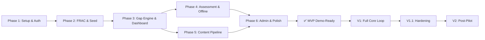

# Phases.md

## StatVidya — Build Phases & Implementation Breakdown

| Field              | Value                                                        |
| ------------------ | ------------------------------------------------------------ |
| Companion docs     | PRD.md, ARCHITECTURE.md, rules.md, Design.md, memory.md      |
| Purpose            | Break the project into sequential, dependency-ordered phases with clear deliverables and exit criteria |
| Status             | Draft v1.0                                                   |

> **How phases map to milestones**: PRD §7 defines four milestones (MVP, V1, V1.1, V2). This document breaks the **MVP** milestone into Phases 1–6, which is the scope that matters for SIH. V1/V1.1/V2 are outlined at the end for roadmap visibility but not broken into daily tasks.

---

## Phase Overview

```mermaid
gantt
    title StatVidya MVP Build Phases
    dateFormat X
    axisFormat %s
    
    section Foundation
    Phase 1 - Project Setup & Auth     :p1, 0, 2d
    
    section Core Data
    Phase 2 - FRAC Domain Model & Seed :p2, after p1, 2d
    
    section Core Loop
    Phase 3 - Competency & Gap Engine  :p3, after p2, 2d
    Phase 4 - Assessment Engine        :p4, after p3, 3d
    
    section Content & Intelligence
    Phase 5 - Content Pipeline & Recs  :p5, after p3, 3d
    
    section Polish
    Phase 6 - Admin, Offline, i18n     :p6, after p4, 2d
```

---

## Phase 1 — Project Setup, Auth & Shell

**Goal**: A deployable app with authentication, role-based navigation, and the complete folder structure. Nothing fancy — but everything builds on this.

**PRD Requirements Covered**: FR-AUTH-1, FR-AUTH-2, FR-RBAC-1, FR-RBAC-2, FR-ORG-1, FR-PWA-1

### Deliverables

| #  | Task                                                                                    | FR Reference  |
| -- | --------------------------------------------------------------------------------------- | ------------- |
| 1  | Initialize Vite + React + TypeScript project in `apps/web/`                             | —             |
| 2  | Set up Tailwind CSS 4.x with the design tokens from Design.md                           | —             |
| 3  | Set up Firebase project (Auth, Firestore, Storage, Functions, Hosting)                   | —             |
| 4  | Create `firebase.json`, `firestore.rules` (deny-all default), `firestore.indexes.json`  | —             |
| 5  | Set up Cloud Functions (2nd gen) boilerplate in `functions/`                              | —             |
| 6  | Implement Firebase Auth (email/password + Google OAuth)                                   | FR-AUTH-1     |
| 7  | Create simulated Parichay SSO with pre-seeded demo personas (one-click login)            | FR-AUTH-2     |
| 8  | Define TypeScript interfaces for all core entities (PRD §13)                              | —             |
| 9  | Create `RequireRole` guard component + role-based route layout                            | FR-RBAC-1     |
| 10 | Set up React Router with the full route map (ARCH §4.1) — pages are stub/placeholder     | —             |
| 11 | Create `AppLayout` (sidebar, topbar, language toggle placeholder)                        | —             |
| 12 | Configure `vite-plugin-pwa` with basic manifest + service worker                          | FR-PWA-1      |
| 13 | Set up ESLint + Prettier config, enforce `strict: true` in tsconfig                       | —             |
| 14 | Set up `react-i18next` with `en/common.json` and `hi/common.json` (navigation strings)    | —             |
| 15 | Create `.env.example` and document all required environment variables                     | —             |
| 16 | First deploy to Firebase Hosting — confirm the shell loads                                | —             |

### Exit Criteria
- [ ] User can sign up, log in (email or Google), and see a role-appropriate dashboard stub
- [ ] Simulated SSO lets you click into a demo persona without entering credentials
- [ ] Routes are guarded — learner can't access `/admin/analytics`
- [ ] App installs as a PWA (Chrome shows install prompt)
- [ ] `organizationId` is present on the User document from account creation
- [ ] Firestore rules deny all writes by default (only Auth-related reads allowed)

---

## Phase 2 — FRAC Domain Model, Seed Data & Provenance

**Goal**: The FRAC-aligned data model is real and visible. Competencies, roles, activities, and courses exist in Firestore with provenance labels. The onboarding flow creates a learner profile.

**PRD Requirements Covered**: FR-TRUST-1, FR-ONB-1, FR-ONB-2, FR-PROFILE-2

### Deliverables

| #  | Task                                                                                     | FR Reference  |
| -- | ---------------------------------------------------------------------------------------- | ------------- |
| 1  | Create seed data files in `apps/web/src/data/` — competencies (15–20), roles (5–8), activities, activity-competency mappings, course catalog | FR-TRUST-1 |
| 2  | Every seed record includes `provenance` field — compile-time enforced via TypeScript      | FR-TRUST-1    |
| 3  | Create `<ProvenanceBadge>` component (✅ Verified / ⚠️ Proposed / 🟡 Synthetic)          | FR-TRUST-1    |
| 4  | Write `scripts/seed-firestore.ts` — idempotent, validates 100% provenance coverage        | FR-TRUST-1    |
| 5  | Build multi-step onboarding: role selection → official details → select government role → initial self-assessment (L1–L5 per competency) | FR-ONB-1 |
| 6  | Field Investigator persona defaults to Hindi locale during onboarding                     | FR-ONB-2      |
| 7  | Create `competency_records` for the user upon onboarding completion (self-assessed)       | FR-PROFILE-2  |
| 8  | Distinguish 🛡️ assessment-verified vs ✍️ self-assessed badges on all competency levels   | FR-PROFILE-2  |
| 9  | Set up Firestore security rules for `competencies`, `roles`, `activities` (read-only for all authenticated), `users` (read/write own), `competency_records` (read own, deny client writes) | FR-RBAC-2, FR-ORG-1 |
| 10 | Run the seed script against dev Firestore and verify data shows up correctly              | —             |

### Exit Criteria
- [ ] New user completes onboarding and arrives at dashboard with a populated competency profile
- [ ] Every domain-data surface in the UI shows a `<ProvenanceBadge>`
- [ ] Seed script validates 100% provenance coverage before writing
- [ ] FI persona onboarding renders in Hindi by default
- [ ] Self-assessed levels are visually distinct from verified levels
- [ ] `competency_records` cannot be written to from the client (Firestore rules deny it)

---

## Phase 3 — Competency Engine, Gap Analysis & Dashboard

**Goal**: The core intelligence loop — gap severity, readiness index, skill gap page, and the learner dashboard. This is where the product starts to feel useful.

**PRD Requirements Covered**: FR-COMP-1, FR-COMP-2, FR-COMP-3, FR-COMP-4, FR-REC-1, FR-REC-2, FR-REC-4

### Deliverables

| #  | Task                                                                                    | FR Reference  |
| -- | --------------------------------------------------------------------------------------- | ------------- |
| 1  | Implement `competencyService.ts` — gap severity formula, readiness index, severity buckets | FR-COMP-1/2/3 |
| 2  | **Unit tests** for severity formula, bucket assignment, readiness index (non-negotiable) | FR-COMP-1/2/3 |
| 3  | Create `CompetencyContext.tsx` — subscribes to user's competency records + role requirements | —          |
| 4  | Build Skill Gap Analysis page — gap cards ordered by severity, each naming the FRAC Activity | FR-COMP-4 |
| 5  | Build `<RadarChart>` component (custom SVG) for competency visualization                 | —             |
| 6  | Build `<ProgressRing>` component (custom SVG) for readiness index                        | —             |
| 7  | Build Learner Dashboard — readiness index, top gaps, recommended next actions             | —             |
| 8  | Implement `recommendationService.ts` — multi-signal course ranking formula                | FR-REC-1      |
| 9  | **Unit tests** for recommendation ranking                                                 | FR-REC-1      |
| 10 | Build Learning Pathways page — ranked courses with "why this" explanation + iGOT deep links | FR-REC-2/4  |
| 11 | Implement `integrationService.ts` — mock iGOT adapter with `SYNTHETIC_DEMO_DATA` label   | FR-IGOT-1/2   |
| 12 | Profile page — competency radar, readiness index, provenance badges                       | —             |

### Exit Criteria
- [ ] Gap severity computation passes unit tests: a Δ=1 critical gap ranks above a Δ=2 desirable gap
- [ ] Readiness index returns 100% when all competencies meet/exceed target
- [ ] Skill Gap page orders gaps by severity, references FRAC Activity names
- [ ] Learning Pathways shows ranked courses with "why" explanations
- [ ] Course cards deep-link to real iGOT pages where real URLs exist
- [ ] Mock iGOT adapter is clearly labeled as demo mode in the UI

---

## Phase 4 — Adaptive Assessment Engine & Offline

**Goal**: The assessment flow works end-to-end, including adaptive difficulty, server-side scoring, offline capability, and competency-record updates via triggers.

**PRD Requirements Covered**: FR-ASSESS-1–5, FR-OFFLINE-1–3, FR-PWA-2

### Deliverables

| #  | Task                                                                                    | FR Reference   |
| -- | --------------------------------------------------------------------------------------- | -------------- |
| 1  | Implement `assessmentService.ts` — adaptive branching logic (medium → harder/easier → converge on L1–L5) | FR-ASSESS-1 |
| 2  | **Unit tests** for adaptive branching: scripted answer sequences converge to expected levels | FR-ASSESS-1  |
| 3  | Build Assessment page UI — timer, question navigation, "flag this question" control, bilingual toggle | FR-ASSESS-2/3 |
| 4  | Create at least 10 Hindi-stem questions for the survey-sampling domain                    | FR-ASSESS-3   |
| 5  | Implement `evaluateAssessment` Cloud Function — validate auth, check idempotency, score server-side, write `assessment_results` | FR-ASSESS-4/5 |
| 6  | Implement `onAssessmentResultCreated` Firestore trigger — update `competency_records`, write `competency_history`, write `audit_log` | FR-ASSESS-5 |
| 7  | Implement `offlineService.ts` — IndexedDB pending-results queue, connectivity detection, sync trigger | FR-OFFLINE-1 |
| 8  | Build offline status indicator (online / cached-offline / pending sync) in active language | FR-OFFLINE-3  |
| 9  | Implement automatic sync on reconnect + manual retry affordance                           | FR-OFFLINE-2  |
| 10 | Configure service worker to cache assessment route + question data for offline use         | FR-PWA-2       |
| 11 | Implement assessment prefetch ("download for offline") action                              | —              |
| 12 | Firestore security rules: `assessment_results` deny client writes, `audit_log` append-only | FR-ASSESS-4   |

### Exit Criteria
- [ ] Adaptive branching unit tests pass for all scripted answer sequences
- [ ] Completing an assessment online updates competency records within seconds
- [ ] Assessment completed in airplane mode is not lost — "results will sync" indicator shows
- [ ] On reconnect, results sync within 30s and competency records update
- [ ] Retry on flaky reconnect doesn't double-score (idempotency via `localId`)
- [ ] Server-side scoring: tampering with client-side answer state doesn't change the persisted score
- [ ] `audit_log` entries exist for every assessment completion, cannot be edited or deleted

---

## Phase 5 — Content Intelligence Pipeline

**Goal**: Trainers can upload documents, AI generates questions in batches with confidence tags, trainers review and approve, approved questions enter the question bank and are immediately available to assessments.

**PRD Requirements Covered**: FR-CONTENT-1–9, FR-AI-2

### Deliverables

| #  | Task                                                                                    | FR Reference   |
| -- | --------------------------------------------------------------------------------------- | -------------- |
| 1  | Build Document Manager page — drag-drop upload with page-range selector                   | FR-CONTENT-1   |
| 2  | Implement `storageService.ts` — upload to Firebase Storage (signed URL pattern)           | —              |
| 3  | Implement `getUploadUrl` Cloud Function                                                   | —              |
| 4  | Client-side text extraction with `pdf.js` + `tesseract.js` OCR fallback                  | FR-CONTENT-2   |
| 5  | Text chunking with section/heading awareness                                              | FR-CONTENT-3   |
| 6  | Implement `generateQuestions` Cloud Function — AI proxy with rate limiting                 | FR-CONTENT-4   |
| 7  | Create MCQ generation prompt in `functions/src/prompts/mcqGeneration.ts` — batched, JSON schema, confidence tags | FR-CONTENT-4/5 |
| 8  | Implement rule-based fallback question generator (`questionGenerator.ts`)                  | FR-CONTENT-9   |
| 9  | Build MCQ Generator page — configure generation (count, difficulty, target competency)     | —              |
| 10 | Build competency validation sanity check screen                                            | FR-CONTENT-6   |
| 11 | Build review queue — sorted low-confidence-first, approve/edit/reject, bulk-approve        | FR-CONTENT-7   |
| 12 | On approval, questions immediately available to assessment engine                          | FR-CONTENT-8   |
| 13 | `onQuestionWrite` Firestore trigger for audit logging                                      | —              |
| 14 | Firestore security rules for `questions` (trainer write) and `documents` (trainer write)   | —              |

### Exit Criteria
- [ ] A 200+ page PDF doesn't freeze the browser (page-range selector works)
- [ ] A scanned PDF still yields extractable text via OCR fallback
- [ ] AI generates 10–15 MCQs in a single batched request with confidence tags
- [ ] Simulating an AI outage triggers rule-based fallback — questions still generated
- [ ] Trainer sees the sanity check, confirms/adjusts competency, then reviews the queue
- [ ] Low-confidence questions appear first in the review queue
- [ ] Approved questions immediately appear in the assessment question bank
- [ ] Every generation/review action creates an audit log entry with prompt version

---

## Phase 6 — Admin Intelligence, i18n Polish & Integration

**Goal**: Admin analytics with the outcome-correlation chart (Lever 2), full i18n polish, and the golden-path demo script runs end-to-end.

**PRD Requirements Covered**: FR-ADMIN-1, FR-ADMIN-3, FR-ADMIN-4, FR-ADMIN-5, FR-I18N-1–3

### Deliverables

| #  | Task                                                                                    | FR Reference   |
| -- | --------------------------------------------------------------------------------------- | -------------- |
| 1  | Build Admin Analytics page — org overview (headcount, average readiness, trend)            | FR-ADMIN-1     |
| 2  | Build role/department breakdown table with drill-down to individuals                       | FR-ADMIN-3     |
| 3  | Implement "Flag for priority training" write-back action                                   | FR-ADMIN-4     |
| 4  | `onTrainingPriorityWrite` Firestore trigger for audit logging                              | FR-ADMIN-4     |
| 5  | Build Outcome Correlation chart — competency level vs. simulated survey-quality metric      | FR-ADMIN-5     |
| 6  | Add "Simulated" watermark + methodology note + `SYNTHETIC_DEMO_DATA` label to chart        | FR-ADMIN-5     |
| 7  | Complete i18n — all navigation, competency names, role names, assessment UI strings in EN + HI | FR-I18N-2  |
| 8  | Language toggle in header + `preferredLanguage` on user profile                             | FR-I18N-3      |
| 9  | FI persona defaults to Hindi without requiring toggle                                       | FR-I18N-3      |
| 10 | Responsive check on mid-range Android tablet viewport                                       | —              |
| 11 | Run golden-path demo script (PRD §22.3) end-to-end                                         | —              |
| 12 | Fix any issues found during the golden-path run                                              | —              |

### Exit Criteria
- [ ] Admin dashboard shows org overview with real (seeded, not hardcoded) numbers
- [ ] Drill-down from department → individual works within the same org
- [ ] Flagging a department persists and is visible to other admins
- [ ] Outcome correlation chart renders with "Simulated" watermark and methodology note
- [ ] Full navigation and assessment flow renders correctly in both English and Hindi
- [ ] Language toggle switches without reload artifacts
- [ ] FI persona defaults to Hindi
- [ ] **Golden-path demo script (PRD §22.3) runs end-to-end** on desktop and tablet viewport

---

## Post-MVP Phases (Roadmap)

These are outlined for planning but not broken into daily tasks. See PRD §7 for full scope.

### V1 — Complete Core Loop

| Area                    | Scope                                                             |
| ----------------------- | ----------------------------------------------------------------- |
| Content pipeline polish | Section-aware source citations (FR-CONTENT-3/10/11)               |
| AI capabilities         | Gap narrator, post-assessment feedback, admin narrative, assistant (FR-AI-1/3/4/5) |
| Profile enrichment      | Competency history timeline, Karma Points, APAR gauge (FR-PROFILE-1/3) |
| Recommendations         | Pathway staging: foundational → applied → capstone (FR-REC-3)     |
| Notifications           | In-app notification list (FR-NOTIF-1)                             |
| iGOT documentation      | Live-mode adapter contract + DSEP/Sunbird reference (FR-IGOT-3/4) |
| Configurability         | Severity weights configurable per org (FR-COMP-5)                 |

### V1.1 — Hardening

- Error boundaries on every route
- WCAG 2.1 AA accessibility audit
- Security-rule audit
- Responsive pass: desktop / tablet / mobile
- Performance pass against NFR targets (PRD §12)
- Demo recording

### V2 — Post-Pilot

- Skill Gap Heatmap (FR-ADMIN-6)
- Training Effectiveness with real data (FR-ADMIN-7)
- Demand Forecasting (FR-ADMIN-8)
- Live iGOT integration (pending gov credentials)
- Semantic search / RAG over documents
- Certifications / verifiable skill passport
- Real government SSO (Parichay / MeriPehchaan)
- Relational analytics layer (Postgres/D1)
- Push/email notifications (FR-NOTIF-2)

---

## Phase Dependency Graph

> **Note**: Phases 4 and 5 can be parallelized if working with a team. Phase 6 depends on both completing because the golden-path demo tests the full flow.

---

*End of document. See memory.md for live progress tracking.*
