# Phases.md

## StatVidya — Build Phases & Implementation Breakdown

| Field | Value |
|---|---|
| Companion docs | PRD.md, Architecture.md, rules.md, Design.md, memory.md |
| Purpose | Break the project into sequential, dependency-ordered phases with clear deliverables and exit criteria |
| Status | **Active v2.0 — Architecture Pivot (Supabase + Cloudflare + Next.js)** |

> **How phases map to milestones**: PRD §7 defines four milestones (MVP, V1, V1.1, V2). This document breaks the **MVP** milestone into Phases 1–6, which represents the core scope for SIH 26101. The post-MVP roadmap is detailed at the end.

---

## Phase Overview

```mermaid
gantt
    title StatVidya MVP Build Phases (v2.0 Stack)
    dateFormat X
    axisFormat %s
    
    section Foundation
    Phase 1 - Next.js Setup, Supabase Auth & Shell  :p1, 0, 2d
    
    section Core Data
    Phase 2 - PostgreSQL Schema, FRAC & Seed Data   :p2, after p1, 2d
    
    section Core Loop
    Phase 3 - Competency Engine & Gap Dashboard     :p3, after p2, 2d
    Phase 4 - Adaptive Assessment Engine & Offline  :p4, after p3, 3d
    
    section Content & Intelligence
    Phase 5 - Cloudflare R2 & Multi-AI Pipeline    :p5, after p3, 3d
    
    section Polish
    Phase 6 - Admin Analytics, Outcome Correlation & i18n :p6, after p4, 2d
```

---

## Phase 1 — Next.js Setup, Supabase Auth & App Shell

**Goal**: A deployable Next.js 15 application on Vercel with Supabase Auth, Parichay SSO demo persona picker, role-based navigation, shadcn/ui components, and `@serwist/next` PWA service worker.

**PRD Requirements Covered**: FR-AUTH-1, FR-AUTH-2, FR-RBAC-1, FR-RBAC-2, FR-ORG-1, FR-PWA-1

### Deliverables

| # | Task | PRD / Arch Reference |
|---|---|---|
| 1 | Initialize Next.js 15 App Router + React 19 + TypeScript project | Arch §3, §13 |
| 2 | Configure Tailwind CSS v4 with `@theme inline` OKLCH tokens and install shadcn/ui | Design.md, PRD §22 |
| 3 | Initialize Supabase client libraries (`@supabase/ssr`, `@supabase/supabase-js`) | Arch §5, §13 |
| 4 | Create Supabase project configuration, `.env.example`, and environment variables | Arch §14 |
| 5 | Implement Supabase Auth (Email/Password + Google OAuth) | FR-AUTH-1 |
| 6 | Create simulated Parichay SSO persona switcher (`/api/sso/demo-persona`) with 4 pre-seeded personas | FR-AUTH-2, Arch §5.2 |
| 7 | Create edge `middleware.ts` for session verification and role-based route guarding | Arch §4.2 |
| 8 | Build responsive App Shell: `AppLayout`, `Sidebar`, `Topbar`, `Breadcrumb`, `OfflineIndicator` | Arch §4.1 |
| 9 | Configure `@serwist/next` PWA service worker with offline manifest and app icons | FR-PWA-1, Arch §11 |
| 10 | Configure bilingual `i18n` dictionary setup (`en.json` and `hi.json`) with language switcher | FR-I18N-1 |
| 11 | Deploy initial shell to Vercel and verify live routing | Arch §15 |

### Exit Criteria
- [ ] User can sign up, log in (Email/Google), or click a demo persona to authenticate without manual typing
- [ ] Simulated Parichay SSO logs in directly as Amit (JSO), Sunita (FI), Priya (Trainer), or Rajesh (Admin)
- [ ] Edge middleware redirects unauthorized users (e.g., Learner accessing `/admin/analytics` redirected to `/dashboard`)
- [ ] App installs as a standalone PWA (Chrome/Edge displays install prompt)
- [ ] `organization_id` claim is populated on user session from account creation
- [ ] Next.js App Shell renders cleanly in both Light and Dark mode using OKLCH color tokens

---

## Phase 2 — PostgreSQL Schema, FRAC Domain Model & Seed Data

**Goal**: The official FRAC-aligned relational schema is deployed in Supabase PostgreSQL with Row Level Security (RLS), multi-tenant isolation, automated audit triggers, and pre-seeded official statistical taxonomy.

**PRD Requirements Covered**: FR-TRUST-1, FR-ONB-1, FR-ONB-2, FR-PROFILE-2, FR-RBAC-2

### Deliverables

| # | Task | PRD / Arch Reference |
|---|---|---|
| 1 | Write Supabase migration `001_initial_schema.sql` (all tables, foreign keys, enums, check constraints) | PRD §23, Arch §6 |
| 2 | Write Supabase migration `002_rls_policies.sql` enforcing multi-tenant `organization_id` checks | PRD §23, Arch §6.2 |
| 3 | Write Supabase migration `003_triggers_and_audit.sql` for automated `audit_log` recording | Arch §6.3 |
| 4 | Create seed script `supabase/seed.sql` populating official FRAC data (Roles, Activities, Competencies) | FR-TRUST-1 |
| 5 | Enforce `provenance` field across all seed records with `<ProvenanceBadge>` component | FR-TRUST-1 |
| 6 | Build multi-step Onboarding flow (`/onboarding`): Cadre selection → Government Role → Initial Self-Assessment | FR-ONB-1 |
| 7 | FI (Field Investigator) persona defaults to Hindi locale automatically during onboarding | FR-ONB-2 |
| 8 | Insert self-assessed `competency_records` upon onboarding completion | FR-PROFILE-2 |
| 9 | Distinguish 🛡️ Assessment-Verified vs ✍️ Self-Assessed badges across all competency views | FR-PROFILE-2 |

### Exit Criteria
- [ ] All PostgreSQL migrations apply cleanly via `supabase db push` or Supabase CLI
- [ ] RLS policies prevent users from accessing data belonging to other organizations
- [ ] Direct client writes to `competency_records` are rejected by RLS (only server functions permitted)
- [ ] Every domain-data element in the UI displays a visible `<ProvenanceBadge>`
- [ ] Onboarding creates a complete learner profile with baseline competency levels

---

## Phase 3 — Competency Engine, Gap Analysis & Dashboard

**Goal**: The core intelligence loop: weighted gap severity calculation, workforce readiness indexing, the interactive Skill Gap radar view, and multi-signal iGOT course recommendations.

**PRD Requirements Covered**: FR-COMP-1–4, FR-REC-1, FR-REC-2, FR-REC-4, FR-IGOT-1, FR-IGOT-2

### Deliverables

| # | Task | PRD / Arch Reference |
|---|---|---|
| 1 | Implement `services/competencyService.ts` (gap severity formula, readiness index, severity buckets) | FR-COMP-1/2/3 |
| 2 | Write comprehensive **unit tests** for severity formulas and bucket boundaries | FR-COMP-1/2/3 |
| 3 | Build Skill Gap Analysis page (`/skill-gap`) — gap cards sorted by severity, referencing FRAC Activities | FR-COMP-4 |
| 4 | Build bespoke `<RadarChart>` SVG component for multi-axis competency visualization | Design.md |
| 5 | Build bespoke `<ProgressRing>` SVG component for visual readiness percentage | Design.md |
| 6 | Build role-adaptive Learner Dashboard (`/dashboard`) — readiness index, top gaps, next best actions | PRD §10 |
| 7 | Implement `services/recommendationService.ts` — multi-signal course ranking algorithm | FR-REC-1 |
| 8 | Build Learning Pathways page (`/pathways`) — ranked courses with "why this" explainability | FR-REC-2/4 |
| 9 | Implement `services/integrationService.ts` — mock iGOT adapter with `SYNTHETIC_DEMO_DATA` badge | FR-IGOT-1/2 |
| 10 | Build Official Profile page (`/profile`) with historical progression and verified competency badges | FR-PROFILE-1/2 |

### Exit Criteria
- [ ] Severity score correctly ranks a $\Delta=1$ Critical gap above a $\Delta=2$ Desirable gap
- [ ] Overall readiness index accurately calculates 100% when all competencies meet or exceed role targets
- [ ] Skill Gap page displays interactive radar chart and FRAC activity mappings
- [ ] Learning Pathways provides explainable recommendations with direct deep-links to iGOT courses
- [ ] Mock iGOT adapter is clearly labeled with demo mode indicators

---

## Phase 4 — Adaptive Assessment Engine & Offline Sync

**Goal**: End-to-end adaptive assessment execution, Supabase Edge Function grading, zero-data-loss offline submission via IndexedDB, and automatic reconciliation upon reconnect.

**PRD Requirements Covered**: FR-ASSESS-1–5, FR-OFFLINE-1–3, FR-PWA-2

### Deliverables

| # | Task | PRD / Arch Reference |
|---|---|---|
| 1 | Implement `services/assessmentService.ts` — 3-stage adaptive branching (Medium → Hard/Easy → L1-L5) | FR-ASSESS-1 |
| 2 | Write **unit tests** verifying branching decision trees converge to appropriate proficiency levels | FR-ASSESS-1 |
| 3 | Build Assessment Runner UI (`/assessment/[id]`) — timer, bilingual question toggle, question navigation | FR-ASSESS-2/3 |
| 4 | Seed 15+ verified bilingual questions for the NSSO survey sampling domain | FR-ASSESS-3 |
| 5 | Implement Supabase Edge Function `evaluate-assessment` (server-side scoring, idempotency check) | Arch §8.2 |
| 6 | Implement `services/offlineService.ts` using `idb` for the `pending_assessments` queue | Arch §11 |
| 7 | Build persistent UI offline banner ("🟠 1 Assessment Pending Sync") with real-time status | FR-OFFLINE-3 |
| 8 | Implement automatic queue flush on `window.online` with exponential backoff retry policy | FR-OFFLINE-2 |
| 9 | Configure Service Worker runtime caching for assessment routes and prefetching | FR-PWA-2 |
| 10 | Verify idempotent submissions: client-generated `local_id` guarantees zero double-scoring | Arch §8.2 |

### Exit Criteria
- [ ] Adaptive branching tests pass across all scripted answer variations
- [ ] Completing an assessment online updates competency records within 2 seconds
- [ ] Assessments taken in Airplane Mode queue reliably in IndexedDB without data loss
- [ ] Restoring network connectivity automatically submits queued assessments within 30 seconds
- [ ] Client tampering with answer payloads cannot spoof the persisted score (server evaluates ground truth)
- [ ] Immutable audit log record is created for every assessment submission

---

## Phase 5 — Cloudflare R2 & Multi-AI Content Generation Pipeline

**Goal**: Trainers can upload massive PDF manuals (>50MB) directly to Cloudflare R2 ($0 egress), generate structured bilingual MCQs via Cloudflare AI Gateway (Gemini → Claude → GPT), and curate questions through a confidence-tagged review queue.

**PRD Requirements Covered**: FR-CONTENT-1–9, FR-AI-2

### Deliverables

| # | Task | PRD / Arch Reference |
|---|---|---|
| 1 | Create Cloudflare R2 bucket (`statvidya-documents`) with CORS configuration | Arch §7 |
| 2 | Build Cloudflare Worker `r2-upload` issuing presigned S3 PUT/GET URLs | Arch §7.2, §8.1 |
| 3 | Build Document Manager page (`/documents`) with direct-to-R2 drag-and-drop file upload | FR-CONTENT-1 |
| 4 | Implement document chunking pipeline using `pdf.js` with semantic heading extraction | FR-CONTENT-2/3 |
| 5 | Build Cloudflare Worker `ai-proxy` routing through Cloudflare AI Gateway | Arch §9.1 |
| 6 | Configure multi-provider fallback: Google Gemini 2.5 Flash → Claude 3.5 Sonnet → GPT-4o-mini | Arch §9.1 |
| 7 | Implement structured JSON schema enforcement for generated MCQs with confidence tags | Arch §9.2 |
| 8 | Implement in-repo rule-based fallback generator (`questionGenerator.ts`) for offline generation | FR-CONTENT-9 |
| 9 | Build MCQ Generator page (`/mcq-generator/[documentId]`) with competency alignment sanity check | FR-CONTENT-6 |
| 10 | Build Trainer Review Queue sorting low-confidence questions first with approve/edit/reject actions | FR-CONTENT-7 |
| 11 | Approved questions write to `questions` table and immediately become available in assessments | FR-CONTENT-8 |

### Exit Criteria
- [ ] Large PDFs (50MB+) stream directly to Cloudflare R2 without transiting web servers
- [ ] AI Gateway generates 10–15 structured bilingual MCQs in a single batched invocation
- [ ] Simulating external AI rate limits triggers immediate automated failover to the secondary provider
- [ ] Complete network disconnect falls back to in-repo rule-based generator
- [ ] Trainer Review Queue surfaces low-confidence questions first with explainable flags
- [ ] Approved questions enter the live assessment question bank immediately

---

## Phase 6 — Admin Intelligence, Outcome Correlation & i18n Polish

**Goal**: MoSPI leadership analytics with macro workforce readiness indices, the training-to-survey outcome correlation engine (Lever 2), write-back priority training flags, and full bilingual polish.

**PRD Requirements Covered**: FR-ADMIN-1, FR-ADMIN-3–5, FR-I18N-1–3

### Deliverables

| # | Task | PRD / Arch Reference |
|---|---|---|
| 1 | Build Admin Analytics Dashboard (`/admin/analytics`) — cadre headcount, average readiness, trends | FR-ADMIN-1 |
| 2 | Build Departmental drill-down table with individual official competency profiles | FR-ADMIN-3 |
| 3 | Implement "Flag Department for Priority Training" write-back action | FR-ADMIN-4 |
| 4 | Connect Supabase Realtime to broadcast priority training updates to all admin/trainer sessions | Arch §2, §6.1 |
| 5 | Build Outcome Correlation Chart: competency level vs. simulated NSSO survey quality metric | FR-ADMIN-5 |
| 6 | Include prominent "Simulated" watermark and methodology disclosure badge | FR-ADMIN-5 |
| 7 | Complete 100% bilingual UI dictionary coverage (`en.json` and `hi.json`) | FR-I18N-2 |
| 8 | Ensure seamless language toggling across all navigation and interactive components | FR-I18N-3 |
| 9 | Validate tablet viewports (768px–1024px) for field investigator workflows | Design.md |
| 10 | Execute end-to-end Golden-Path demo walkthrough (PRD §32) | PRD §32 |

### Exit Criteria
- [ ] Admin dashboard displays live, calculated workforce readiness indices across all cadres
- [ ] Priority training flags persist to database and broadcast in real-time
- [ ] Outcome correlation chart renders scatter plot with regression trendline and clear methodology disclaimers
- [ ] Complete app navigation and assessment flow operates flawlessly in Hindi and English
- [ ] Golden-path demo script executes from start to finish without errors or delays

---

## Post-MVP Roadmap

| Version | Focus Area | Key Deliverables |
|---|---|---|
| **V1 — Complete Core Loop** | AI Polish & Staging | Gap narrator, post-assessment feedback, pathway staging (foundational → applied → capstone), in-app notifications |
| **V1.1 — Hardening** | Accessibility & Security | WCAG 2.1 AA audit, full RLS penetration testing, Playwright E2E test suites |
| **V2 — Post-Pilot** | Enterprise MoSPI Scaling | Live iGOT Sunbird API integration, real NIC Jan-Parichay OIDC registration, skill heatmaps, automated demand forecasting |

---

*End of Phases.md. Companion document: Architecture.md.*
