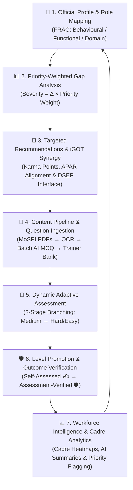

# 🏛️ EduWrap — AI-Enabled Competency Intelligence & Adaptive Learning Platform
### *Empowering India's Official Statistical System (MoSPI / NSSTA) under Mission Karmayogi*

[](https://vitejs.dev/)
[](https://react.dev/)
[](https://tailwindcss.com/)
[](https://firebase.google.com/)
[](https://cloudflare.com/)
[](https://ai.google.dev/)
[](#-frac-alignment--methodology)
[](#-sih-26101-problem-statement)

---

## 📌 Executive Summary

**EduWrap** is an enterprise-grade, AI-driven competency intelligence and adaptive learning ecosystem built for the **Ministry of Statistics and Programme Implementation (MoSPI)** and the **National Statistical Systems Training Academy (NSSTA)**. 

Aligned directly with the **FRAC (Framework of Roles, Activities and Competencies)** methodology under **Mission Karmayogi**, EduWrap transitions government capacity building from static, episodic classroom lectures to continuous, data-driven competency progression. It bridges the gap between field enumerators (NSSO FOD) and central statistical officers (ISS/SSS) by unifying skill gap analysis, adaptive diagnostic assessments, automated document-to-MCQ generation, and integration with **iGOT Karmayogi**.

---

## 🎯 SIH 26101 Problem Statement

| Attribute | Details |
| :--- | :--- |
| **Problem Title** | AI-Enabled Learning Platform for India's Official Statistical System |
| **Target Ministry** | Ministry of Statistics and Programme Implementation (MoSPI) / NSSTA |
| **Core Target Users** | Indian Statistical Service (ISS), Subordinate Statistical Service (SSS), NSSO Field Operations Division (FOD) Enumerators, State DES, Training Faculty |
| **Core Mandate** | Dynamic competency gap identification, adaptive assessments, single-batch AI MCQ generation from official manuals, iGOT Karmayogi synergy, and workforce capability analytics |

---

## 🔄 The Closed-Loop Competency Engine

EduWrap operates on a self-reinforcing, continuous intelligence loop:



---

## ✨ Key Architectural Capabilities

### 1. 🎖️ FRAC-Aligned Competency Intelligence
* **Three-Construct Hierarchy**: Strict adherence to official Mission Karmayogi methodology: `ROLE` → `ACTIVITY` → `COMPETENCY`.
* **Standard Categories**: Spans **Behavioural**, **Functional** (e.g., Data Governance, Quality Assurance), and **Domain** (e.g., Survey Sampling & Estimation, CAPI Operations, National Accounts).
* **5-Level Proficiency Scale (L1–L5)**: Transparent progression from Novice (L1) to Master/Policy Architect (L5).
* **Dual-Layer Trust Badging**: Clean visual distinction between self-assessed claims (✍️) and empirically verified skills (🛡️).

### 2. ⚖️ Priority-Weighted Gap Analysis Engine
* Traditional systems treat all skill deficits identically. EduWrap computes gap severity by weighting the competency deficit against the operational criticality of the associated activity:
  $$\text{Severity Score} = (\text{Target Level} - \text{Current Level}) \times \text{Priority Weight}$$
  *Critical ($\times 3$), Important ($\times 2$), Desirable ($\times 1$)*.
* Ensures critical survey enumeration gaps outrank non-urgent administrative proficiencies.

### 3. 📑 Content Intelligence: Automated Document-to-MCQ Pipeline
* **High-Speed Extraction & OCR**: Ingests dense MoSPI survey manuals and training circulars via PDF.js with client-side Tesseract.js OCR fallback.
* **15-Page Chunk Safety Limit**: Prevents browser memory lockup when ingesting 200+ page statistical manuals.
* **Single-Prompt Batch AI Generation**: Generates 10–15 structured, curriculum-aligned MCQs per call via Google Gemini proxy, respecting API rate limits.
* **Stage 5a Competency Validation Check**: Sanity checks questions against the designated competency before review.
* **Trainer Curation Queue**: Confidence tags (`high`, `medium`, `low`) direct faculty attention to ambiguous questions before publishing to the institutional Question Bank.

### 4. 🧪 Dynamic Adaptive Assessment Engine
* **3-Stage Branching Model**: Eliminates monolithic static tests.
  * **Stage 1**: Baseline questions at medium difficulty.
  * **Stage 2 & 3**: Branching to hard or easy pools in real time based on cumulative mastery.
* **Granular Topic Scoring**: Evaluates sub-concepts independently (e.g., Stratified Sampling vs. Multiplier Calibration).
* **Tamper-Proof Evaluation**: Assessment submissions are processed server-side via trusted Cloudflare Workers with Admin SDK privileges—client code cannot directly manipulate competency scores.

### 5. 🤝 iGOT Karmayogi & Parichay Integration
* **DSEP Protocol Architecture**: Built on Decentralized Skilling and Education Protocol standards compatible with the Sunbird/DIKSHA stack.
* **Karma Points & APAR Integration**: Accrues Karma Points for course completions, tracking progress toward annual appraisal benchmarks.
* **Live Catalog Deep Linking**: Contextual links bridge directly into live courses on `igotkarmayogi.gov.in`.
* **Simulated Jan-Parichay Gov SSO**: Instant one-click persona switching (e.g., JSO Amit Sharma, Faculty Dr. Rao, Director General) adhering to National Single Sign-On standards.

### 6. 🌐 Multilingual & Inclusive Design
* **Bilingual Switcher (English / हिंदी)**: Essential for ground-level NSSO enumerators conducting rural household surveys.
* **Accessible Component Architecture**: Contrast-tested, high-performance UI styled with custom design tokens.

---

## 👥 Targeted User Personas

| Role | User Persona | Primary Focus & Dashboard Surface |
| :--- | :--- | :--- |
| **Learner** | Junior/Senior Statistical Officers (JSO/SSO), NSSO FOD Enumerators | Skill gap radar, adaptive assessments, Karma Points, APAR appraisal milestones, localized course recommendations. |
| **Trainer** | NSSTA Faculty, MoSPI Subject Matter Experts | Document ingestion, AI MCQ generation, confidence-sorted review queue, Question Bank maintenance. |
| **Admin** | Director General, MoSPI Cadre Controlling Authority | Workforce readiness heatmaps, AI-generated macro gap summaries, cadre priority training write-back actions. |

---

## 🏗️ System Architecture & Technology Stack

```
┌────────────────────────────────────────────────────────────────────────┐
│                        CLIENT LAYER (Vite + React 19)                  │
│  Tailwind CSS v4 • Framer Motion • Lucide React • React Context API    │
│  Bilingual (EN/HI) • Simulated Parichay SSO • Responsive Layouts       │
└───────────────────┬───────────────────────────────┬────────────────────┘
                    │                               │
       Direct SDK   │                               │ Secure API
       (Read-only)  ▼                               ▼ (Evaluations & AI)
┌───────────────────────────────┐     ┌──────────────────────────────────┐
│       FIREBASE BACKEND        │     │     CLOUDFLARE WORKER PROXY      │
│  • Firebase Authentication    │     │  • AI Routing (GEMINI_MODEL)     │
│  • Cloud Firestore (Realtime) │◄────┤  • Server-side Assessment Eval   │
│  • Firebase Storage (Uploads) │     │  • Firebase Admin SDK Auth       │
│  • Multi-tenant Org Scoping   │     │  • Server-Side Rate Limiter      │
└───────────────────────────────┘     └─────────────────┬────────────────┘
                                                        │ Secure Invocation
                                                        ▼
                                      ┌──────────────────────────────────┐
                                      │        GOOGLE GEMINI API         │
                                      │  (Single-Prompt Batch Generation │
                                      │   & Gap Narrative Explanations)  │
                                      └──────────────────────────────────┘
```

### Technology Breakdown

* **Frontend**: React 19, Vite 8, React Router DOM v7
* **Styling & Animation**: Tailwind CSS v4, Framer Motion, Canvas Confetti
* **State & Data Caching**: React Context API, LocalForage (IndexedDB)
* **Document Processing**: PDF.js, Tesseract.js (Worker-based OCR)
* **Backend & Security**: Firebase Auth, Cloud Firestore with strict multi-tenant security rules (`organizationId`)
* **Serverless Intelligence**: Cloudflare Workers, Firebase Admin SDK
* **AI Engine**: Google Gemini (model dynamically configured via `GEMINI_MODEL` environment variable)

---

## 📂 Project Directory Structure

```
EduWrap/
├── public/                    # Static assets
├── scripts/                   # Seeding and migration utilities
│   └── seed-firestore.js      # One-command Firestore data population
├── src/
│   ├── components/            # Reusable atomic UI components (Cards, Badges, Modals)
│   ├── contexts/              # Application state providers (User, Quiz, File, etc.)
│   ├── data/                  # Domain seed definitions & FRAC competencies
│   │   ├── competencies.js    # FRAC Behavioural, Functional & Domain catalog
│   │   ├── roles.js           # MoSPI / ISS / NSSO FOD role definitions
│   │   ├── courses.js         # Curated course catalog with iGOT deep links
│   │   └── questions.js       # Pre-validated baseline question bank
│   ├── firebase/              # Firebase configuration, Firestore helpers, security rules
│   │   ├── firebaseConfig.js  # App initialization
│   │   └── firestore.js       # Abstracted CRUD operations
│   ├── layouts/               # Shell wrappers (AppLayout, AuthLayout, SettingsLayout)
│   ├── pages/                 # Role-based views & core workflows
│   │   ├── Dashboard.jsx      # Adaptive persona dashboard (Learner/Trainer/Admin)
│   │   ├── Profile.jsx        # Professional profile & Competency Radar Chart
│   │   ├── Quiz.jsx           # Adaptive assessment taking interface
│   │   ├── Files.jsx          # Training manual & document manager
│   │   └── ...                # Additional views
│   ├── services/              # Pure domain logic & service adapters
│   │   ├── competencyService.js # Priority gap calculations & readiness index
│   │   ├── assessmentService.js # Branching logic & level promotions
│   │   ├── questionGenerator.js # Rule-based NLP fallback engine
│   │   └── pdfService.js      # PDF text extraction & OCR coordination
│   ├── index.css              # Design system tokens & Tailwind v4 styles
│   └── main.jsx               # Entrypoint & router configuration
├── worker/                    # Cloudflare Worker serverless backend
│   ├── index.js               # Route dispatcher & CORS handler
│   └── wrangler.toml          # Worker configuration & bindings
├── IMPLEMENTATION_PLAN.md     # Master architectural design document
├── MEMORY.md                  # Development memory & execution guardrails
└── package.json               # Dependencies and scripts
```

---

## 🚦 Getting Started

### Prerequisites
* **Node.js**: v18.0.0 or higher
* **npm**: v9.0.0 or higher
* A Firebase Project with Firestore and Authentication enabled

### 1. Clone & Install
```bash
# Clone the repository
git clone https://github.com/StudyApp-Project/EduWrap.git
cd EduWrap

# Install dependencies
npm install
```

### 2. Environment Configuration
Create a `.env` file in the root directory:
```env
VITE_FIREBASE_API_KEY=your_api_key
VITE_FIREBASE_AUTH_DOMAIN=your_project.firebaseapp.com
VITE_FIREBASE_PROJECT_ID=your_project_id
VITE_FIREBASE_STORAGE_BUCKET=your_project.appspot.com
VITE_FIREBASE_MESSAGING_SENDER_ID=your_sender_id
VITE_FIREBASE_APP_ID=your_app_id
```

### 3. Run Local Development Server
```bash
npm run dev
```
Open [http://localhost:5173](http://localhost:5173) in your browser.

### 4. Build & Production Verification
```bash
# Verify ESLint rules
npm run lint

# Compile production bundle
npm run build

# Preview production build locally
npm run preview
```

---

## 📜 Data Provenance & Governance Declarations

To maintain institutional transparency, all datasets used in EduWrap are cataloged by provenance:

| Category | Component | Provenance Label |
| :--- | :--- | :--- |
| **Methodology** | FRAC Role → Activity → Competency structure | ✅ **VERIFIED OFFICIAL** (Mission Karmayogi standard) |
| **Framework** | Behavioural / Functional / Domain categorization | ✅ **VERIFIED OFFICIAL** |
| **Cadres & Designations** | ISS, SSS, NSSO FOD, CSO, State DES | ✅ **VERIFIED OFFICIAL** (Gazetted designations) |
| **Ecosystem** | iGOT Karmayogi scale, Karma Points, APAR link | ✅ **VERIFIED FACT** |
| **Domain Framework** | MoSPI-specific competencies & L1–L5 descriptors | ⚠️ **PROPOSED FRAMEWORK** (NSSTA-aligned research) |
| **Formulas** | Priority-weighted severity, dynamic branching rules | ⚠️ **PROPOSED METHODOLOGY** |
| **Demo Catalog** | Course catalog, simulated questions, mock users | 🟡 **SYNTHETIC DEMO DATA** (For demonstration) |

---

## 🛡️ Security & Privacy Guardrails

* **Zero Client-Side Credentials**: AI tokens and Firebase Service Account secrets never touch the browser.
* **Server-Enforced Promotion**: Learners cannot self-promote competency levels; all promotions require trusted Worker verification.
* **Multi-Tenant Data Isolation**: Every Firestore entity includes `organizationId`. Security rules restrict document access to authorized organizational boundaries.
* **HR-Data Sensitivity**: Self-assessed gaps are partitioned from administrative oversight to encourage candid, fear-free skill reporting.

---

## 🤝 Contributing & License

Developed as part of the **Smart India Hackathon (SIH 26101)** initiative.  
Distributed under the **ISC License**. Refer to [LICENSE](file:///Users/vamsikrishna/Dev%20Projects/SiH/LICENSE) for terms.
