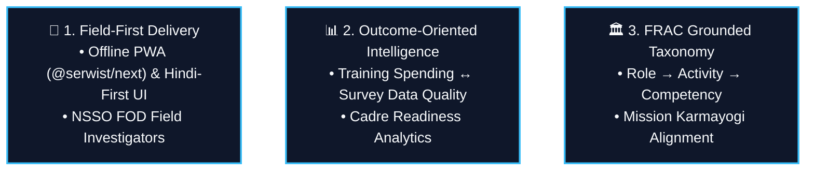

# 🇮🇳 StatVidya

### *Workforce Competency Intelligence Platform for India's Official Statistical System*
*Engineered for MoSPI & NSSTA under Mission Karmayogi (SIH 26101)*

[](https://www.sih.gov.in/)
[](https://karmayogi.gov.in/)
[](https://igotkarmayogi.gov.in/)
[](https://nextjs.org/)
[](https://tailwindcss.com/)
[](https://supabase.com/)
[](https://cloudflare.com/)
[](https://ai.google.dev/)

---

## 🎯 Executive Overview

**StatVidya** is a domain-grounded workforce competency intelligence platform built specifically for India's Official Statistical System (**MoSPI**, NSSO, ISS/SSS cadres, State DES offices).

Positioned as the intelligence layer above **iGOT Karmayogi** (10M+ registered civil servants), StatVidya identifies specific competency gaps, delivers offline/Hindi-first field assessments, and directly correlates training investments with measurable improvements in field survey data quality.

```
Profile → Assess → Gap → Recommend → Learn (via iGOT) → Practice → Reassess → Repeat
```

---

## 🚀 Key Strategic Differentiators



1. **Field Personnel First (NSSO FOD)**: Built with an offline-first PWA architecture and native Hindi (Devanagari) interface for enumerators on low-cost Android tablets.
2. **Training → Outcome Correlation**: Statistically correlates competency levels with field survey error reduction, moving beyond self-referential quiz scores.
3. **FRAC Grounded**: Uses Mission Karmayogi’s official **Framework of Roles, Activities and Competencies** (Role $\to$ Activity $\to$ Competency) rather than an invented taxonomy.

---

## 🏛️ 3-Provider Cloud Architecture (v2.0)

```
┌─────────────────────────────────────────────────────────────────────────────┐
│                                CLIENT TIER                                  │
│  Next.js 15 App Router + Tailwind CSS v4 (OKLCH) + @serwist/next PWA        │
│  State: TanStack Query + React Context | Offline: IndexedDB (`idb` queue)   │
└───────────────────┬──────────────────────┬──────────────────────┬───────────┘
                    │                      │                      │
      Direct HTTPS  │        BFF HTTPS     │        Direct Upload │
      & Realtime WS │        API Routes    │        & AI Proxy    │
                    ▼                      ▼                      ▼
┌──────────────────────────────┐ ┌──────────────────┐ ┌───────────────────────┐
│       SUPABASE TIER          │ │   VERCEL TIER    │ │    CLOUDFLARE TIER    │
│                              │ │                  │ │                       │
│  • Supabase Auth (JWT)       │ │  • Next.js App   │ │  • Cloudflare Workers │
│  • Parichay OIDC SSO         │ │    Server Comps  │ │    ├─ r2-upload       │
│  • PostgreSQL 16+ with RLS   │ │  • Edge API      │ │    └─ ai-proxy        │
│  • Edge Functions (Deno)     │ │    BFF Gate      │ │  • Cloudflare R2      │
│  • Realtime WebSocket PubSub │ │                  │ │    ($0 Egress PDFs)   │
│  • Storage (Avatars)         │ │                  │ │  • Cloudflare AI      │
│                              │ │                  │ │    Gateway (Failover) │
└──────────────────────────────┘ └──────────────────┘ └───────────┬───────────┘
                                                                  │
                                                                  ▼
                                                      ┌───────────────────────┐
                                                      │ EXTERNAL AI CHAIN     │
                                                      │ 1. Gemini 2.5 Flash   │
                                                      │ 2. Claude 3.5 Sonnet  │
                                                      │ 3. GPT-4o-mini        │
                                                      │ 4. In-Repo Rule Engine│
                                                      └───────────────────────┘
```

---

## 👥 Personas Supported

| Persona | Primary Focus | Key Capabilities |
| :--- | :--- | :--- |
| 🌾 **Sunita Devi** (Field Investigator) | NSSO FOD Field Enumeration | Offline PWA assessment runner, Hindi-first UI, zero data-loss sync |
| 👨‍💼 **Amit Sharma** (Junior Statistical Officer) | MoSPI HQ / SSS Cadre | FRAC gap analysis, APAR milestone tracking, iGOT course enrolment |
| 👨‍🏫 **Dr. Priya Verma** (NSSTA Faculty) | Training Academies | Direct-to-R2 large manual upload, AI MCQ generation, review queue |
| 🏢 **Rajesh Kumar** (Additional Director General) | MoSPI Leadership | Macro readiness index, training priority write-back, outcome correlation |

---

## 📜 Domain Grounding & Data Provenance

StatVidya enforces a 100% visible **Provenance Labeling Policy** across all domain data:

| Label | Meaning | Coverage |
| :--- | :--- | :--- |
| ✅ **`VERIFIED_OFFICIAL`** | Real government structure or fact | FRAC methodology, Cadres (ISS/SSS/FOD), iGOT ecosystem |
| ⚠️ **`PROPOSED_FRAMEWORK`** | Product team's proposed model | Specific MoSPI competencies, L1–L5 descriptors, severity weighting |
| 🟡 **`SYNTHETIC_DEMO_DATA`** | Simulated for demonstration | Course catalog, demo question bank, mock aggregate metrics |

---

## 🛠️ Complete Tech Stack

- **Frontend**: Next.js 15 (App Router), React 19, Tailwind CSS v4, shadcn/ui, Lucide Icons
- **PWA & Offline**: `@serwist/next` Service Worker, IndexedDB (`idb` queue), bilingual i18n
- **Database & Auth**: Supabase PostgreSQL 16+ (Row Level Security), Supabase Auth, Parichay OIDC SSO
- **Serverless & Storage**: Supabase Edge Functions (Deno), Cloudflare R2 ($0 egress), Cloudflare Workers
- **AI Engine**: Cloudflare AI Gateway with automated failover (Gemini 2.5 Flash → Claude 3.5 Sonnet → GPT-4o-mini → In-repo Rule Engine)

---

## ⚡ Quick Start

```bash
# 1. Clone repository
git clone https://github.com/StudyApp-Project/SiH.git
cd SiH

# 2. Install dependencies
npm install

# 3. Environment configuration
cp .env.example .env.local

# 4. Start Supabase (Local or Remote)
npx supabase start

# 5. Start development server
npm run dev
```

---

## 📄 License & Governance

Developed for **Smart India Hackathon (SIH 26101)** for the **Ministry of Statistics and Programme Implementation (MoSPI)** / **NSSTA**.
