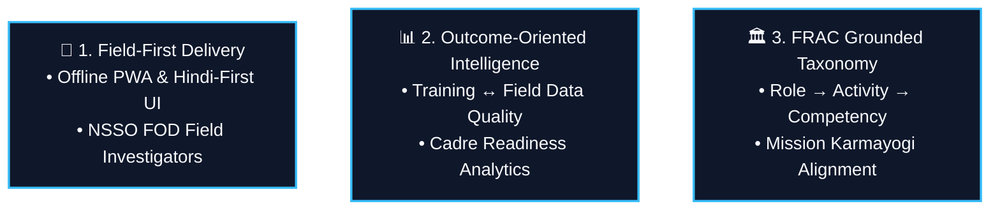
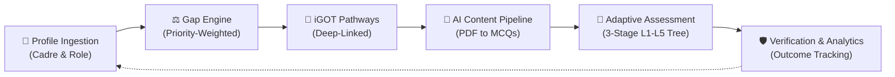

# 🇮🇳 StatVidya

### *Workforce Competency Intelligence Platform for India's Official Statistical System*
*Engineered for MoSPI & NSSTA under Mission Karmayogi (SIH 26101)*

[](https://www.sih.gov.in/)
[](https://karmayogi.gov.in/)
[](https://igotkarmayogi.gov.in/)
[](https://react.dev/)
[](https://tailwindcss.com/)
[](https://firebase.google.com/)
[](https://ai.google.dev/)

---

## 🎯 Executive Overview

**StatVidya** is an intelligent, domain-grounded workforce competency platform built specifically for India's Official Statistical System (**MoSPI**, NSSO, ISS/SSS cadres, State DES offices).

Unlike generic LMS platforms or basic quiz generators, StatVidya fills the critical intelligence layer above **iGOT Karmayogi**: it identifies specific competency gaps, delivers offline/Hindi-first field assessments, and links training spending to real statistical outcome improvements.

```
Profile → Assess → Gap → Recommend → Learn (via iGOT) → Practice → Reassess → Repeat
```

---

## 🚀 Key Differentiation Levers



1. **Field Personnel First (NSSO FOD)**: Built for offline tablets and Hindi-first workflows for enumerators in the field—the largest and most critical workforce segment.
2. **Training → Outcome Correlation**: Measures whether training improves statistical survey output quality, moving beyond self-referential quiz scores.
3. **FRAC Grounded**: Uses Mission Karmayogi’s official **Framework of Roles, Activities and Competencies** (Role $\to$ Activity $\to$ Competency) rather than an invented taxonomy.

---

## 💡 The Core Loop



---

## 👥 Personas Supported

| Persona | Primary Focus | Key Capabilities |
| :--- | :--- | :--- |
| 🌾 **Field Investigator** | NSSO FOD Field Enumeration | Offline PWA assessment, Hindi locale, zero data-loss sync |
| 👨‍💼 **Desk Officer** | MoSPI HQ / ISS / SSS Cadre | FRAC gap analysis, APAR milestone tracking, iGOT Karma Points |
| 👨‍🏫 **Trainer** | NSSTA / TPAC Faculty | AI PDF-to-MCQ batch pipeline, confidence review queue, question bank |
| 🏢 **Administrator** | Department Head / MoSPI Leadership | Macro readiness index, priority training write-back, outcome correlation |

---

## 📜 Domain Grounding & Data Provenance

StatVidya enforces a 100% visible **Provenance Labeling Policy** across all domain data:

| Label | Meaning | Coverage |
| :--- | :--- | :--- |
| ✅ **`VERIFIED_OFFICIAL`** | Real government structure or fact | FRAC methodology, Cadres (ISS/SSS/FOD), iGOT ecosystem |
| ⚠️ **`PROPOSED_FRAMEWORK`** | Product team's proposed model | Specific MoSPI competencies, L1–L5 descriptors, severity weighting |
| 🟡 **`SYNTHETIC_DEMO_DATA`** | Simulated for demonstration | Course catalog, demo question bank, mock aggregate metrics |

---

## 🛠️ Tech Stack & Architecture

- **Frontend**: React 19, Vite 8, Tailwind CSS v4, Lucide Icons, Framer Motion
- **PWA & Offline**: Workbox Service Worker, IndexedDB queue, `react-i18next`
- **Backend & Auth**: Firebase Auth (Gov SSO simulation), Cloudflare Workers
- **Database & Storage**: Firebase Firestore (Realtime), Firebase Storage
- **AI & Processing**: Google Gemini Flash (Structured JSON batch mode), PDF.js

---

## ⚡ Quick Start

```bash
# 1. Clone repository
git clone https://github.com/StudyApp-Project/SiH.git
cd SiH

# 2. Install dependencies
npm install

# 3. Environment configuration
cp .env.example .env

# 4. Start dev server
npm run dev
```

---

## 📄 License & Governance

Developed for **Smart India Hackathon (SIH 26101)** for the **Ministry of Statistics and Programme Implementation (MoSPI)** / **NSSTA**.
