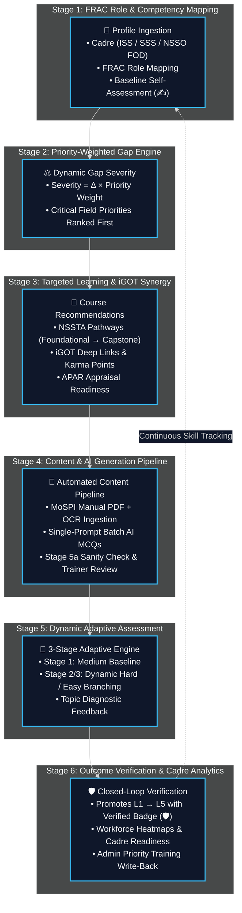
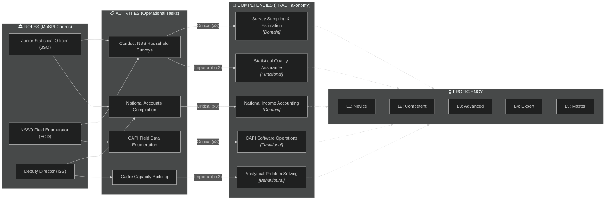
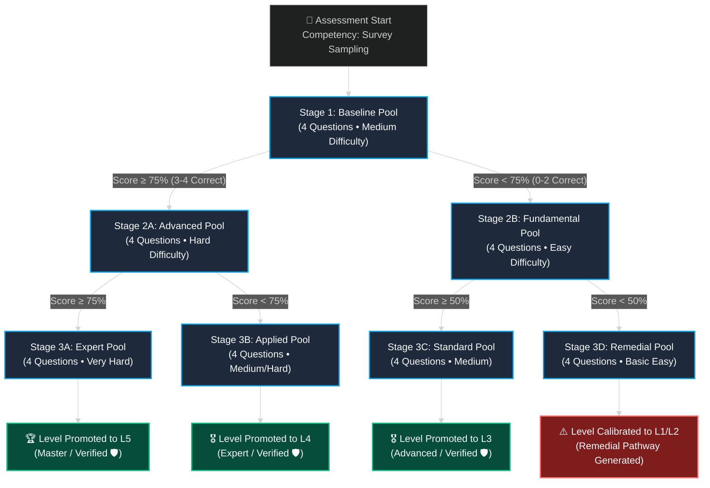
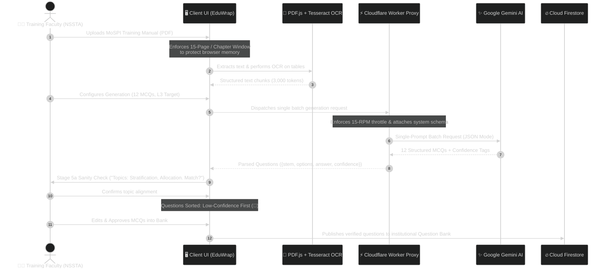
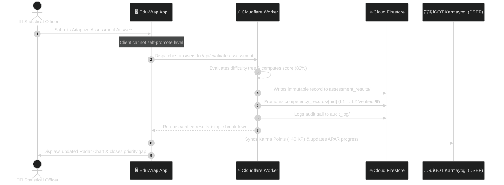
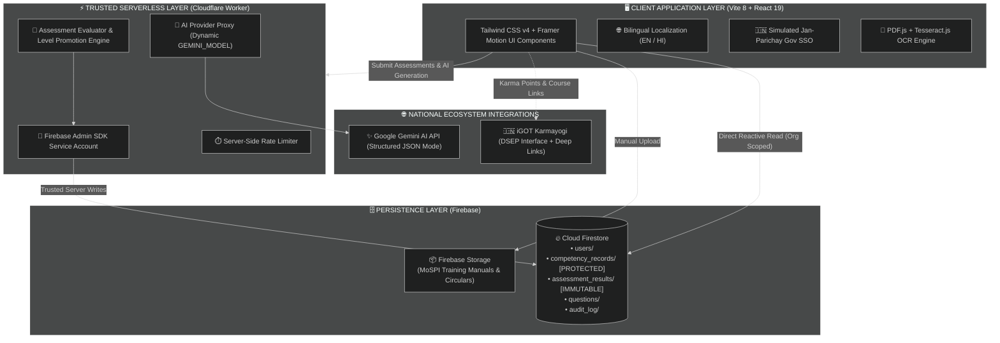
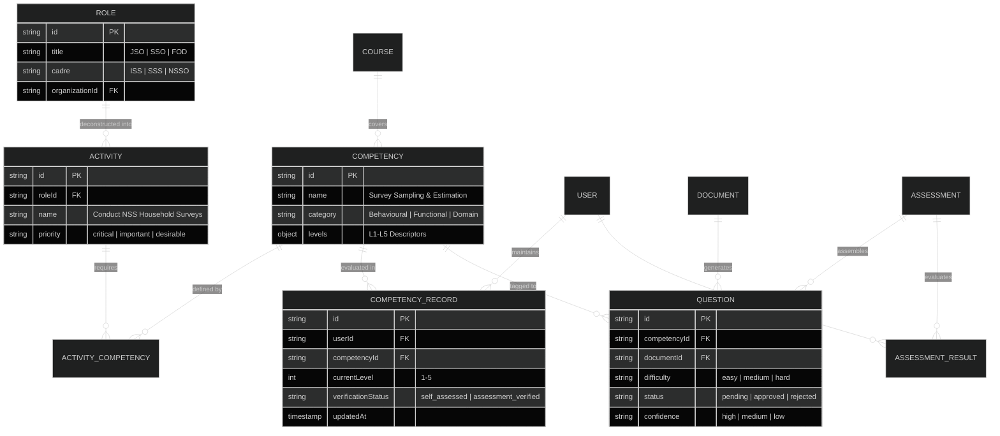

# 🏛️ EduWrap — Competency Intelligence & Adaptive Learning Ecosystem
### *Engineered for India's Official Statistical System (MoSPI / NSSTA) under Mission Karmayogi*

[](https://www.sih.gov.in/)
[](https://karmayogi.gov.in/)
[](https://igotkarmayogi.gov.in/)
[](https://react.dev/)
[](https://tailwindcss.com/)
[-FFCA28?style=flat-square&logo=firebase&logoColor=black)](https://firebase.google.com/)
[](https://workers.cloudflare.com/)
[](https://ai.google.dev/)

---

## 🎯 Strategic Alignment: SIH 26101

| Parameter | Operational Specification |
| :--- | :--- |
| **Problem Statement** | **SIH 26101**: AI-enabled learning platform for India's Official Statistical System |
| **Nodal Ministry & Academy** | **MoSPI** (Ministry of Statistics and Programme Implementation) & **NSSTA** (National Statistical Systems Training Academy) |
| **Target Cadres** | Indian Statistical Service (**ISS**), Subordinate Statistical Service (**SSS**), **NSSO** Field Operations Division (**FOD**) Enumerators, State **DES** |
| **National Framework** | **FRAC** (Framework of Roles, Activities and Competencies) under **Mission Karmayogi** |
| **Core Innovation** | Priority-weighted gap analysis + 3-stage adaptive diagnostic assessment + PDF-to-MCQ AI pipeline + DSEP iGOT synergy |

---

## 🔄 1. The Closed-Loop Competency Architecture

EduWrap eliminates the gap between static training and real-time field proficiency through a self-reinforcing, six-stage intelligence cycle:



---

## 🗺️ 2. FRAC Framework Mapping (Role $\to$ Activity $\to$ Competency)

The platform strictly mirrors Mission Karmayogi's **Role $\to$ Activity $\to$ Competency** data architecture across **Behavioural**, **Functional**, and **Domain** competencies:



### Institutional Cadre Mapping Matrix

| Cadre Role | Operational Activity | Associated Competency | Type | Target | Priority Weight |
| :--- | :--- | :--- | :---: | :---: | :---: |
| **Junior Statistical Officer (JSO)** | Conduct NSS Household Surveys | Survey Sampling & Estimation | Domain | **L3** | 🔴 **Critical ($\times 3$)** |
| **Junior Statistical Officer (JSO)** | Scrutiny of Survey Schedules | Statistical Quality Assurance | Functional | **L3** | 🟡 **Important ($\times 2$)** |
| **NSSO Field Enumerator (FOD)** | Field Household Data Collection | CAPI Hardware/Software Tools | Functional | **L4** | 🔴 **Critical ($\times 3$)** |
| **NSSO Field Enumerator (FOD)** | Ground Relisting & Boundary Mapping | GIS & Ground Truthing | Domain | **L2** | 🟢 **Desirable ($\times 1$)** |
| **Senior Statistical Officer (SSO)** | Index Number Calculation (CPI/IIP) | Economic Statistics & Indexing | Domain | **L4** | 🔴 **Critical ($\times 3$)** |
| **Deputy Director (ISS)** | National Accounts & GDP Estimation | National Accounts Statistics (NAS) | Domain | **L5** | 🔴 **Critical ($\times 3$)** |
| **All Statistical Personnel** | Cross-Cadre Statistical Coordination | Analytical Problem Solving | Behavioural | **L3** | 🟡 **Important ($\times 2$)** |

---

## ⚖️ 3. Priority-Weighted Gap Analysis Engine

Traditional platforms compute skill gaps as a naive subtraction ($\text{Target} - \text{Current}$). EduWrap weights each deficit by the operational criticality of the official's duties:

$$\Large \text{Severity Score} = (\text{Target Level} - \text{Current Level}) \times \text{Priority Weight}$$

$$\text{Where: } \text{Critical} = 3 \quad\vert\quad \text{Important} = 2 \quad\vert\quad \text{Desirable} = 1$$

### Worked Example: JSO Amit Sharma (NSSO FOD)

```
Target Role: Junior Statistical Officer (JSO) | Total Readiness Index: 58%
```

| Competency | Required | Current Verified | Gap ($\Delta$) | Activity Priority | Severity Score | Action Status |
| :--- | :---: | :---: | :---: | :---: | :---: | :--- |
| **Survey Sampling & Estimation** | **L3** | **L1** (✍️ Self) | $\Delta = 2$ | 🔴 Critical ($\times 3$) | **$2 \times 3 = 6$** | 🚨 **Critical Gap (Rank 1)** |
| **CAPI Data Collection** | **L3** | **L2** (🛡️ Verified) | $\Delta = 1$ | 🔴 Critical ($\times 3$) | **$1 \times 3 = 3$** | ⚠️ **Urgent Action (Rank 2)** |
| **Statistical Quality Assurance** | **L3** | **L2** (✍️ Self) | $\Delta = 1$ | 🟡 Important ($\times 2$) | **$1 \times 2 = 2$** | 🟡 **Moderate Gap (Rank 3)** |
| **GIS Ground Truthing** | **L2** | **L1** (✍️ Self) | $\Delta = 1$ | 🟢 Desirable ($\times 1$) | **$1 \times 1 = 1$** | 🟢 **Low Priority (Rank 4)** |
| **Analytical Problem Solving** | **L3** | **L3** (🛡️ Verified) | $\Delta = 0$ | 🟡 Important ($\times 2$) | **$0 \times 2 = 0$** | ✅ **Proficient** |

> **Key Takeaway**: A 1-level gap on a Critical Activity ($1 \times 3 = 3$) outranks a 1-level gap on an Important Activity ($1 \times 2 = 2$).

---

## 🧪 4. Dynamic Adaptive Assessment Engine

Assessments use a **3-stage dynamic difficulty branching tree** that adjusts test difficulty in real time based on cumulative answers:



---

## 📑 5. Content Intelligence & Batch AI MCQ Pipeline

The content pipeline ingests unstructured MoSPI training manuals and transforms them into validated assessment banks without exceeding rate limits:



---

## 🛡️ 6. Closed-Loop Verification & iGOT Karma Points Flow



---

## 👥 7. Role-Based Feature Matrix

| Feature / Capability | 👨‍💼 Learner (Officer) | 👨‍🏫 Trainer (Faculty) | 🏢 Administrator (DG) |
| :--- | :---: | :---: | :---: |
| **Simulated Jan-Parichay Gov SSO** | ✅ | ✅ | ✅ |
| **Bilingual Toggle (English / हिंदी)** | ✅ | ✅ | ✅ |
| **Competency Radar & Dual-Tier Badges (🛡️/✍️)** | ✅ *(Self)* | ✅ | ✅ *(Cadre Aggregates)* |
| **Priority-Weighted Gap Analysis** | ✅ | ❌ | ✅ *(Macro Overview)* |
| **Dynamic Adaptive Assessments** | ✅ | ❌ | ❌ |
| **Question Flagging Affordance** | ✅ | ❌ | ❌ |
| **MoSPI Manual PDF Ingestion & OCR** | ❌ | ✅ | ❌ |
| **Batch AI MCQ Generation Pipeline** | ❌ | ✅ | ❌ |
| **Confidence-Sorted Review Queue** | ❌ | ✅ | ❌ |
| **Institutional Question Bank Management** | ❌ | ✅ | ✅ |
| **iGOT Karma Points & APAR Tracking** | ✅ | ❌ | ✅ *(Read-Only)* |
| **Workforce Skill Heatmap** | ❌ | ❌ | ✅ |
| **AI Macro Gap Narrative Summaries** | ❌ | ❌ | ✅ |
| **Priority Training Write-Back Action** | ❌ | ❌ | ✅ |

---

## 🏗️ 8. System Architecture Topology



---

## 🗂️ 9. Entity-Relationship Data Model



---

## 📜 10. Data Provenance & Trust Classification

All domain and framework definitions are classified by institutional provenance to guarantee transparency:

| Classification | Data Entity | Justification & Source |
| :--- | :--- | :--- |
| ✅ **VERIFIED OFFICIAL** | **FRAC Methodology** | Framework of Roles, Activities and Competencies (One of Six Pillars of Mission Karmayogi). |
| ✅ **VERIFIED OFFICIAL** | **Government Cadre Designations** | Indian Statistical Service (ISS), Subordinate Statistical Service (SSS), NSSO FOD Enumerators. |
| ✅ **VERIFIED FACT** | **iGOT Karmayogi Ecosystem** | 1+ crore registered civil servants, Sunbird/DIKSHA backend, DSEP Protocol, Karma Points linked to APAR. |
| ⚠️ **PROPOSED FRAMEWORK** | **MoSPI Competency Framework** | Specific MoSPI statistical competencies nested under Behavioural, Functional, and Domain categories. |
| ⚠️ **PROPOSED METHODOLOGY** | **Severity & Scoring Rules** | Priority-weighted gap formula: $\text{Severity} = \Delta \times \text{Priority Weight}$; 3-stage adaptive branching logic. |
| 🟡 **SYNTHETIC DEMO DATA** | **Simulation Assets** | Mock employee profiles, demonstration questions, and synthetic course catalog. |

---

## ⚡ 11. Quick Start & Developer Guide

### Prerequisites
* **Node.js**: v18.0+
* **npm**: v9.0+

```bash
# 1. Clone repository
git clone https://github.com/StudyApp-Project/EduWrap.git
cd EduWrap

# 2. Install all dependencies
npm install

# 3. Configure environment variables (.env)
cp .env.example .env

# 4. Start local development server
npm run dev

# 5. Production quality verification gate
npm run lint       # Clean ESLint audit
npm run build      # Clean Vite 8 production build
```

---

## 🏛️ Institutional Governance

* **Competition Problem**: Smart India Hackathon (SIH 26101)
* **Designated Beneficiary**: Ministry of Statistics and Programme Implementation (**MoSPI**) / National Statistical Systems Training Academy (**NSSTA**)
* **License**: Open Source under the **ISC License**
